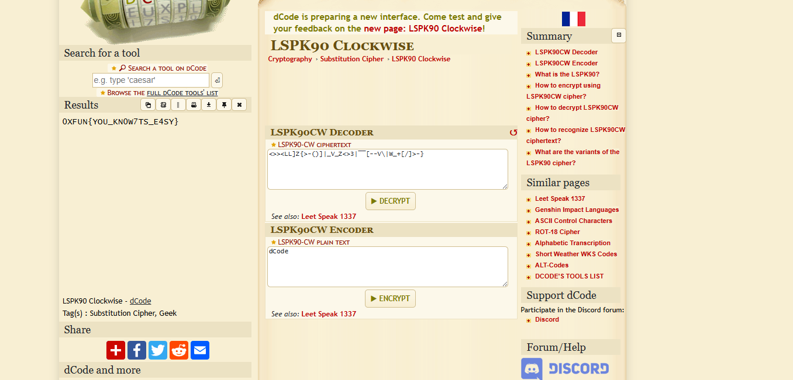

# Challenge Name: Back in the 90's

## Description

**Category:** Crypto

> *Back in the 90's, I was in a very famous TV show. Everything was analog, flashy, and a little out of place just like the symbols people used back then.*
>
> *Can you decode it and recover the flag?*

**Reference:** [BoJack Horseman - Back in the 90's](https://youtu.be/FBw-Z8ULwcc)

**Provided file:** [cipher.txt](Resources/cipher.txt)

**Flag format:** `0xfun{...}`

---

## Writeup

### Step 1: Inspecting the Ciphertext

The provided [cipher.txt](Resources/cipher.txt) contains:

```
<>><LL]Z{>-()]|_V_Z<>3|¯¯[--V\|W_+[/]>-}
```

The characters look like ASCII symbols rotated or flipped — consistent with **Leet Speak 90° Clockwise (LSPK90-CW)**.

### Step 2: Identifying the Cipher

Head over to [dcode.fr](https://www.dcode.fr/cipher-identifier) and use the **Cipher Identifier** with the ciphertext. The highest confidence match is:

**[LSPK90-CW — Leet Speak 90° Clockwise](https://www.dcode.fr/lspk90-cw-leet-speak-90-degrees-clockwise)**

### Step 3: Decoding

Use the [LSPK90-CW decoder on dcode.fr](https://www.dcode.fr/lspk90-cw-leet-speak-90-degrees-clockwise) to decrypt the ciphertext.



### Step 4: Reading the Flag

The decoded output gives us the flag.

---

## Resources

- **[Resources/cipher.txt](Resources/cipher.txt)** — Challenge ciphertext.
- **[Resources/LSPK90_Decoder.png](Resources/LSPK90_Decoder.png)** — Screenshot of the dcode.fr decoder output.

---

## Flag

```
0XFUN{YOU_KN0W7TS_E4SY}
```
