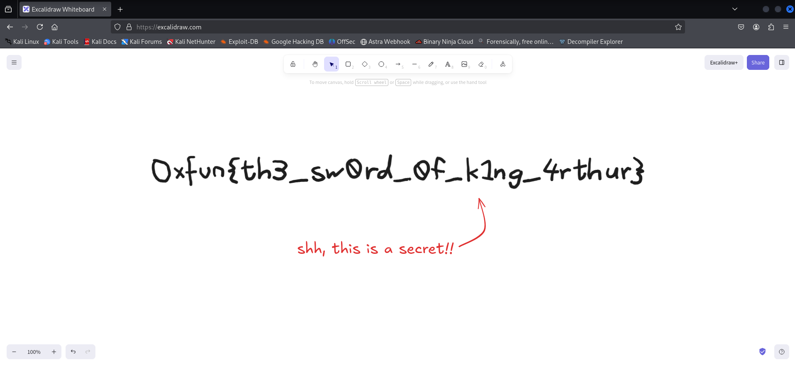

# Challenge Name: Nothing Expected

## Description

**Category:** Forensics

> Here's a small drawing I put together. There isn't really anything in it, as you can tell.

**Provided file:** [file.png](Resources/file.png)

**Flag format:** `0xfun{...}`

---

## Writeup

### Step 1: Inspecting the PNG

We are given [file.png](Resources/file.png). Check type and metadata:

```bash
file Resources/file.png
exiftool Resources/file.png
```

ExifTool shows a **tEXt** chunk with key `applicationvndexcalidrawjson` and a long value. The PNG embeds **Excalidraw** scene data (JSON with `encoding: "bstring"`, `compressed: true`, and an `encoded` field containing binary/zlib data).



### Step 2: Extracting the Excalidraw Scene

The embedded data is **zlib-compressed** and stored with JSON escapes. Use the provided **[extract_excalidraw.py](Resources/extract_excalidraw.py)** to:

1. Parse the PNG chunks and read the Excalidraw JSON.
2. Decompress and decode the `encoded` field.
3. Write a valid `.excalidraw` file.

```bash
python3 Resources/extract_excalidraw.py
```

### Step 3: Opening in Excalidraw

Open [scene.excalidraw](Resources/scene.excalidraw) in [Excalidraw](https://excalidraw.com/) (web or desktop). The canvas contains text or shapes that spell the flag.

### Step 4: Reading the Flag

The flag is visible in the drawing as text elements.

---

## Resources

- **[Resources/file.png](Resources/file.png)** — Challenge PNG with embedded Excalidraw JSON.
- **[Resources/nothingexpected.png](Resources/nothingexpected.png)** — Screenshot of the challenge image.
- **[Resources/extract_excalidraw.py](Resources/extract_excalidraw.py)** — Script to extract and build the .excalidraw file.
- **[Resources/scene.excalidraw](Resources/scene.excalidraw)** — Extracted Excalidraw scene to open in the editor.

---

## Flag

```
0xfun{th3_sw0rd_0f_k1ng_4rthur}
```
