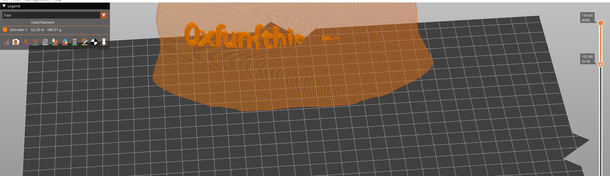

# Challenge Name: PrintedParts

## Description

**Category:** Forensics

> A friend of mine 3D printed something interesting.

**Provided file:** [3D.gcode](Resources/3D.gcode)

**Flag format:** `0xfun{...}`

---

## Writeup

### Step 1: Recognizing the File

The challenge provides a **G-code** file: [3D.gcode](Resources/3D.gcode). G-code describes toolpaths for 3D printers — the layers can form text or shapes when viewed from the right angle.

### Step 2: Visualizing the G-code

Load the G-code in a slicer or viewer that supports **preview mode**, e.g. [PrusaSlicer](https://prusaslicer.net/#download). Use the preview to see the path and layers.


### Step 3: Reading the Flag

In the preview, part of the flag is visible as text (e.g. `0xfun{this`). Move the view (camera to the right or rotate) to see more. The toolpath lines spell out the full flag.



### Step 4: Assembling the Flag

Combine the visible parts into the full flag.

---

## Resources

- **[Resources/3D.gcode](Resources/3D.gcode)** — Challenge G-code file.
- **[Resources/godot.png](Resources/godot.png)** — Screenshot of G-code preview.
- **[Resources/progress-godot.png](Resources/progress-godot.png)** — Screenshot showing flag in toolpath.

---

## Flag

```
0xfun{this_monkey_has_a_flag}
```
