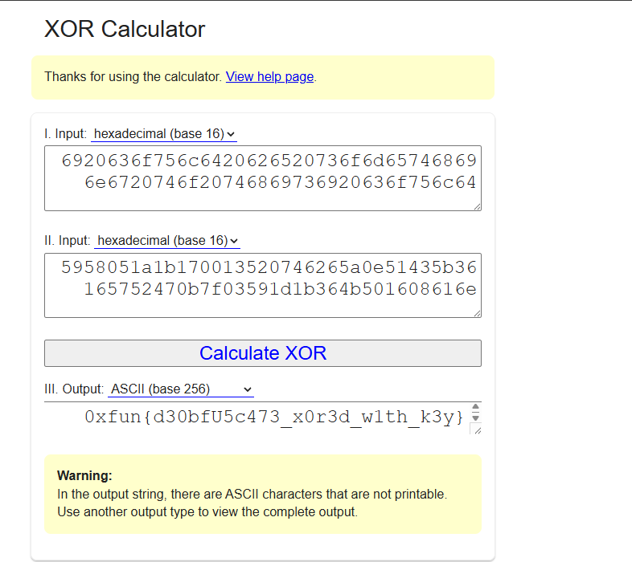

# Challenge Name: Tesla

## Description

**Category:** Forensics

> Flipper Zero, often referred to as a hacking device, is designed to capture frequencies and execute commands. It's considered a risky tool to have, as it is illegal in some countries.

**Provided file:** [Tesla.sub](Resources/Tesla.sub)

**Flag format:** `0xfun{...}`

---

## Writeup

### Step 1: Inspecting the Binary

The challenge provides **[Tesla.sub](Resources/Tesla.sub)** (Flipper SubGhz / binary data). Convert the binary to ASCII (e.g. in CyberChef). The result is a **batch-style** script with variable substitution: a string variable (e.g. `IlÃc`) and many `%IlÃc:~offset,1%` segments that select single characters. There is also a PowerShell/Base64 fragment.

### Step 2: Extracting the Message with a Script

Run the provided **[solve.py](Resources/solve.py)** to interpret the batch logic and extract the character sequence:

```bash
python3 Resources/solve.py
```

The script output looks like:

```
... i could be something to this 5958051a1b170013520746265a0e51435b36165752470b7f03591d1b364b501608616e ive been encrypted many in ways ...
```

The hex string is the **ciphertext**. Direct hex decoding does not give plaintext.

### Step 3: Known Plaintext XOR

We know the flag starts with `0xfun{` → hex `307866756e7b`.

XOR the first 6 bytes of the ciphertext with this known plaintext:

```
307866756e7b ⊕ 5958051a1b17 → "i coul"
```

This matches the phrase "i could be something to this" — confirming it as the **XOR key**.

### Step 4: Decrypting

XOR the full ciphertext with the repeating key to recover the flag.




---

## Resources

- **[Resources/Tesla.sub](Resources/Tesla.sub)** — Challenge file (Flipper SubGhz).
- **[Resources/solve.py](Resources/solve.py)** — Extracts message and performs XOR decryption.
- **[Resources/decoded_payload.txt](Resources/decoded_payload.txt)** — Intermediate decoded batch script output.
- **[Resources/partial-key.png](Resources/partial-key.png)** — Screenshot of XOR key derivation.
- **[Resources/flag.png](Resources/flag.png)** — Screenshot of the decrypted flag.

---

## Flag

```
0xfun{d30bfU5c473_x0r3d_w1th_k3y}
```
