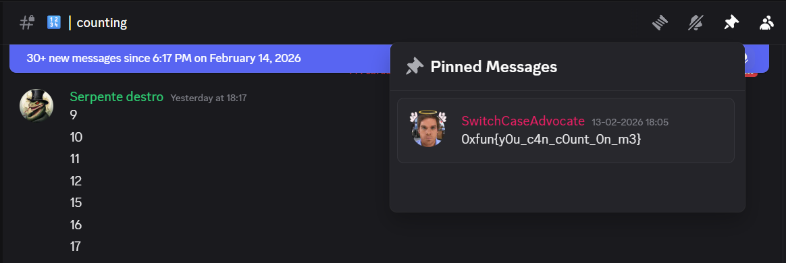

# Challenge Name: Counting

## Description

In the Discord server there's a counting channel. Will you be able to collaborate with other players to reach the goal and retrieve the flag? Good luck!

---

## Writeup

### Step 1: Finding the Counting Channel

Join the 0xFUN CTF Discord server (link from the [CTFtime event](https://ctftime.org/event/3081) or challenge description).

### Step 2: Participating in the Count

Locate the counting channel and participate with other players to increment the counter toward the stated goal.

### Step 3: Retrieving the Flag

When the goal is reached, the flag is revealed—for example in a **pinned message** in the counting channel.



---

## Resources

- **[Resources/image.png](Resources/image.png)** — Screenshot of the pinned message with the flag (optional).

---

## Flag

```
0xfun{y0u_c4n_c0unt_0n_m3}
```

---
