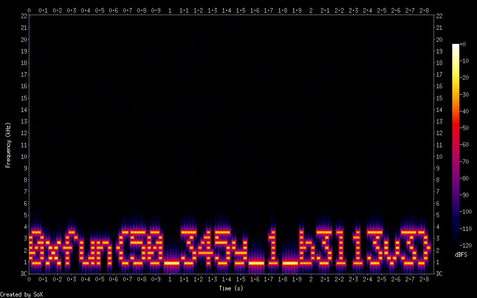

# Challenge Name: Spectrum

## Description

**Category:** Misc

> It appears too simple to be a real challenge. Increasing the difficulty is essential.

**Provided file:** [audio.wav](Resources/audio.wav)

**Flag format:** `0xfun{...}`

---

## Writeup

### Step 1: Inspecting the Audio

We are given [audio.wav](Resources/audio.wav) (Microsoft PCM, 16 bit, mono 44100 Hz). Viewing the **spectrogram** in a tool (e.g. Audacity, Sonic Visualiser) shows a first message: `0xfun{50_345y_1_b3l13v3}`.



That is a **decoy** — the real flag is hidden elsewhere.

### Step 2: Extracting Hidden Data from the WAV

Use **Deepsound** to extract a file hidden in the WAV:


The extracted file is [si.txt](Resources/si.txt) and contains a URL:

```
https://cybersharing.net/s/33864416ca80f2c5
```

### Step 3: Downloading the Next File

Visit the URL and download the file (e.g. `seccat.png`).

### Step 4: Fixing the PNG

The downloaded file ([seccat.png](Resources/seccat.png)) is a corrupted PNG (`pngcheck` reports "first chunk must be IHDR"). Use the provided [fix.py](Resources/fix.py) to repair the file:

```bash
python3 Resources/fix.py
```

This produces [seccat_fixed.png](Resources/seccat_fixed.png).

### Step 5: Reading the Flag

Open the fixed PNG. The image contains the real flag.


---

## Resources

- **[Resources/audio.wav](Resources/audio.wav)** — Challenge audio file.
- **[Resources/spectogram.png](Resources/spectogram.png)** — Screenshot of spectrogram (decoy flag).
- **[Resources/deepsound.png](Resources/deepsound.png)** — Screenshot of Deepsound extraction.
- **[Resources/si.txt](Resources/si.txt)** — Extracted file from Deepsound (contains URL).
- **[Resources/fix.py](Resources/fix.py)** — Script to fix the corrupted PNG header.
- **[Resources/seccat.png](Resources/seccat.png)** — Downloaded corrupted PNG.
- **[Resources/seccat_fixed.png](Resources/seccat_fixed.png)** — Repaired PNG containing the flag.

---

## Flag

```
0xfun{c47s_4r3_n07_s33_7hr0ugh_bu7_7h3y_4r3_cur10us}
```
