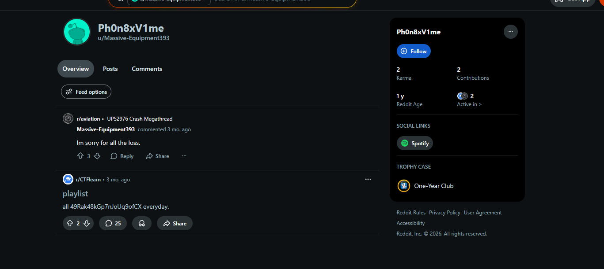
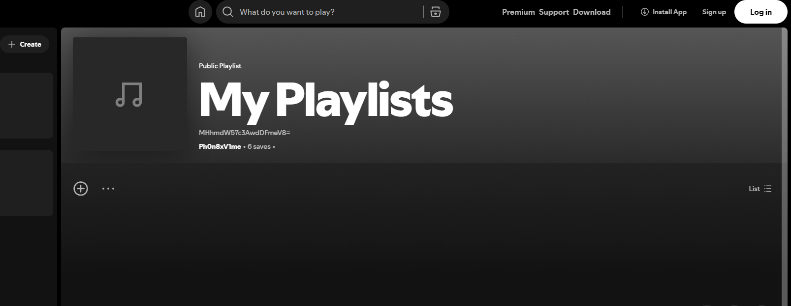

# Challenge Name: MultiVerse

## Description

**Category:** OSINT

> I have a friend named **Massive-Equipment393** who's obsessed with music. Try to figure out what his favorite genre is.

**Flag format:** `0xfun{...}`

---

## Writeup

### Step 1: Username Lookup

Use **Sherlock** or [WhatIsMyName](https://whatismyname.app/) to find accounts for **Massive-Equipment393** ([full results](Resources/Massive-Equipment393.txt)).

### Step 2: Reddit and First Flag Part

On **Reddit**: [Massive-Equipment393](https://www.reddit.com/user/Massive-Equipment393/)

Their Reddit display name is **Ph0n8xV1me** ([lookup results](Resources/Ph0n8xV1me.txt)).

In their comments, find:

```
Playlist
all 49Rak48kGp7nJoUq9ofCX everyday.
```

The string `49Rak48kGp7nJoUq9ofCX` is **Base58**. Decode it to get:

```
pl4yl1st_3xt3nd
```

This is the **first part** of the flag.

### Step 3: Spotify and Second Part

The user's profile links to **Spotify**:

```
https://open.spotify.com/user/3164whos3zc5xss6lv7ejfdlmogi
```

In one playlist (name or description) find a **Base64** string:

```
MHhmdW57c3AwdDFmeV8=
```

Decode to get: `0xfun{sp0t1fy_` — the **second part** of the flag.





### Step 4: Third Part

Find the **third part** of the flag using the same or another linked platform (e.g. another playlist, bio, or linked profile). Combine all parts in order to form the full flag.

---

## Resources

- **[Resources/Massive-Equipment393.txt](Resources/Massive-Equipment393.txt)** — Username lookup results for Massive-Equipment393.
- **[Resources/Ph0n8xV1me.txt](Resources/Ph0n8xV1me.txt)** — Username lookup results for Ph0n8xV1me.
- **[Resources/Reddit_profile.png](Resources/Reddit_profile.png)** — Screenshot of the Reddit profile.
- **[Resources/Spotify_Playlist.png](Resources/Spotify_Playlist.png)** — Screenshot of the Spotify playlist.

---

## Flag

Combine the three parts (e.g. `0xfun{sp0t1fy_`, `pl4yl1st_3xt3nd`, and the third segment) into the full flag: `0xfun{...}`.
