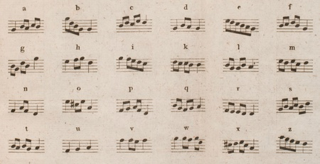
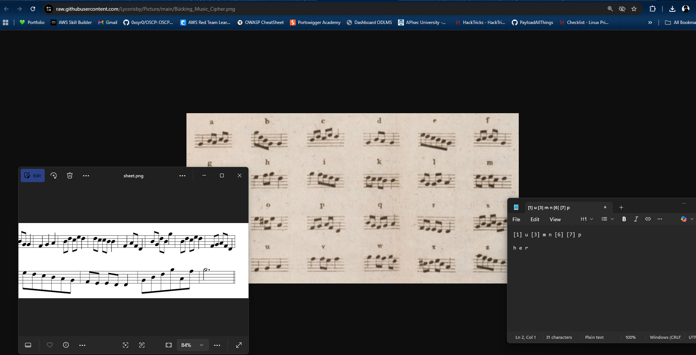

# Challenge Name: Music

## Description

**Category:** Warmup

> The specific type of music notation or sheet music that is commonly utilized within the language and linguistics industry, particularly for the purposes of phonetic transcription, language learning, or linguistic analysis.

**Note:** Flag must be embedded into the format.

**Flag format:** `0xfun{...}`

---

## Writeup

### Step 1: Recognizing the Notation

The challenge refers to notation used in linguistics and phonetic transcription. The sheet music provided uses a cipher system mapping musical notes to letters.


### Step 2: Identifying the Cipher

Research into music-based ciphers used in linguistics leads to the **Bucking Music Cipher** (also known as the Music Cipher) — a system that maps musical notes to letters of the alphabet.



### Step 3: Decoding with the Bucking Music Cipher

Apply the **Bucking Music Cipher** decoding (see [Music cipher — Wikipedia](https://en.wikipedia.org/wiki/Music_cipher)) to the sequence in the sheet music.



### Step 4: Formatting the Flag

Embed the decoded result into the required flag format.

---

## Resources

- **[Resources/sheet.png](Resources/sheet.png)** — Challenge sheet music.
- **[Resources/Bücking_Music_Cipher.jpg](Resources/Bücking_Music_Cipher.jpg)** — Bucking Music Cipher reference.
- **[Resources/music-cipher.png](Resources/music-cipher.png)** — Screenshot of the decoding process.

---

## Flag

```
0xfun{buckingcipher}
```
