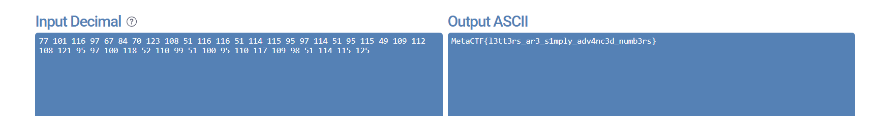

## **Challenge Name: Ask Key**  

### **Solves**  
- **Solves**: 410  
- **Points**: 125  

---

### **Description**  
Someone sent me this weird number, but I suspect that every few digits actually represent characters. Can you figure out what it means?  

```
7710111697678470123108511161165111411595971145195115491091121081219597100118521109951100951101171099851114115125
```

---

### **Approach**  

The challenge text hints at "few digits actually represent characters," which suggests that the numbers correspond to ASCII decimal values. The challenge name, `Ask Key`, also implies working with ASCII.  

However, the numbers are not separated by delimiters, making it difficult to directly convert them to characters. To solve this, we manually add padding by segmenting the numbers based on their range. ASCII values for readable characters range from 32 (space) to 126 (`~`), so we split the digits accordingly.  

After segmenting the digits, the string looks like this:  
```
77 101 116 97 67 84 70 123 108 51 116 116 51 114 115 95 97 114 51 95 115 49 109 112 108 121 95 97 100 118 52 110 99 51 100 95 110 117 109 98 51 114 115 125
```  

Next, convert these decimal values (Base 10) to their corresponding ASCII characters (Base 256).  

The decoded text is:  
```
MetaCTF{l3tt3rs_ar3_s1mply_adv4nc3d_numb3rs}
```

  

---

### **Answer**  
```
MetaCTF{l3tt3rs_ar3_s1mply_adv4nc3d_numb3rs}
```  