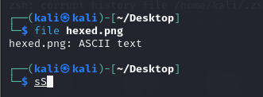
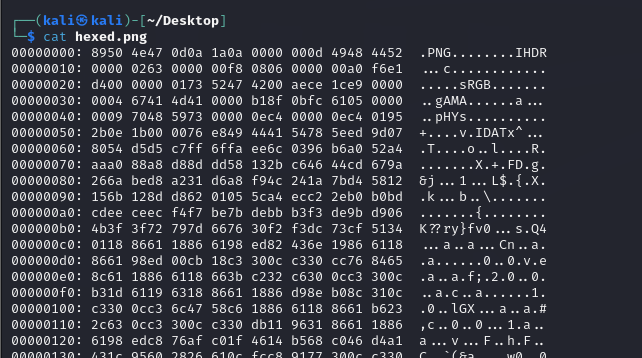

Here’s your write-up formatted properly:

---

## **Challenge Name: Hexed**  

### **Solves**  
- **Solves**: 157  
- **Points**: 150  

---

### **Description**  
Oh no! Our picture of a flag has been cursed! Can you undo the curse and recover the cursed flag image?

## **Attachments**: [hexed.png](Resources/hexed.png)

---

### **Approach**  

A cursed image—tried opening it after downloading, but we couldn't view it. Let's examine its contents using the Linux terminal.  

1. Ran the `file` command, and it returned that the file contains **ASCII data**.  
   

2. Then, I used `cat` to print the contents of the file and observed a **hexdump** of a PNG file.  
   

It looks like we need to extract the hex data from the dump, remove the ASCII conversions, offsets, extra whitespace, and line breaks, and then convert the hex values to binary. Finally, we save it as a PNG file.

To automate this, I wrote a Python script to extract the hex values from the 11th to the 50th character and store them. After processing the hex values (removing whitespace and converting them to binary), we get the output image.

You can find the script in [script.py](Resources/script.py), and the final output image is saved as `output.png`. When we opened `output.png`, it revealed the flag:  
```
flag{h3xdump_15n7_4_cur53}
```


---

### **Answer**  
```
flag{h3xdump_15n7_4_cur53}
```