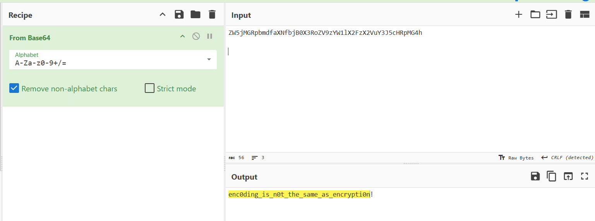

## **Challenge Name: Into The Crypto-Verse**  

### **Solves**  
- **Solves**: 1408
- **Points**: 100 

---

### **Description**  
Welcome to the C3 cryptography team! Our team helps consult in a variety of areas around the security department, helping to make sure our company is using proper encryption & data storage as well as sometimes in forensic investigations.

The finance team ensured us that all of their data is "properly encrypted and stored". They were so sure, in fact, that they sent you a snippet of their data to see if you could crack it:

`ZW5jMGRpbmdfaXNfbjB0X3RoZV9zYW1lX2FzX2VuY3J5cHRpMG4h`

---

### **Approach**  

Looking at both the email and password, they have trailing `=` characters, which are typically Base64 padding. Let's decode them using CyberChef.  

1. **Decoding the Email**:  
   The given string looks like a Base64 Encoded String. Let's use cyberchef to decode it.

   After decoding, we get - `enc0ding_is_n0t_the_same_as_encrypti0n!` and that's our answer.

     

---

### **Answer**  
```
enc0ding_is_n0t_the_same_as_encrypti0n!
```  