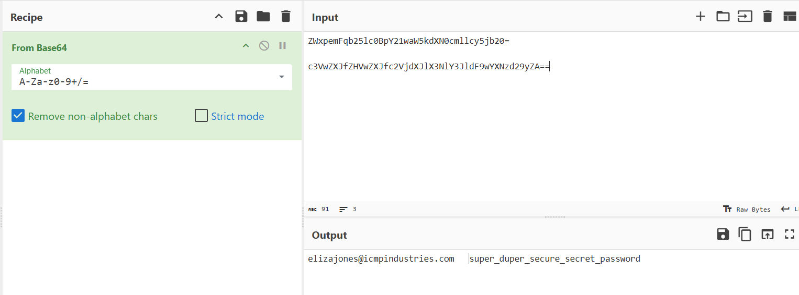

## **Challenge Name: It's Hiring Season**  

### **Solves**  
- **Solves**: 1869  
- **Points**: 100  

---

### **Description**  
One of the engineering managers is super excited to introduce the new hire to the team but needs a way to securely send the new engineer Slack credentials. Usually, they hand over the credentials in person on their first day, but she wants the new engineer to be able to meet her team a few days in advance.  

Someone on her team had suggested encrypting them to email and had sent her the "encrypted" credentials to pass along to the new hire. She wanted to run this by the security team first to get their opinion.  

What do you think? Are these credentials safe to email out? See if you can crack the "encryption."  

- **Email**: `ZWxpemFqb25lc0BpY21waW5kdXN0cmllcy5jb20=`  
- **Password**: `c3VwZXJfZHVwZXJfc2VjdXJlX3NlY3JldF9wYXNzd29yZA==`  

---

### **Approach**  

Looking at both the email and password, they have trailing `=` characters, which are typically Base64 padding. Let's decode them using CyberChef.  

1. **Decoding the Email**:  
   Using a Base64 decode recipe, we get:  
   ```
   elizajones@icmpindustries.com
   ```

2. **Decoding the Password**:  
   Applying the same decoding recipe, we retrieve:  
   ```
   super_duper_secure_secret_password
   ```

      


---

### **Answer**  
```
super_duper_secure_secret_password
```  