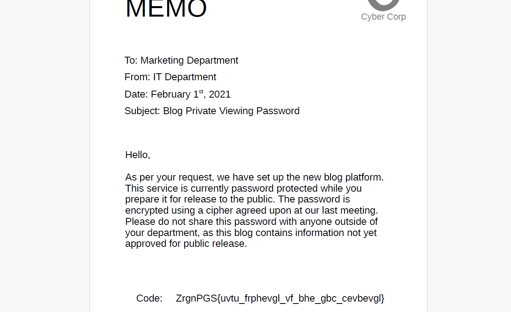

## **Challenge Name: Not So Private Browsing 1**  

### **Solves**  
- **Solves**: 576
- **Points**: 100  

---

### **Description**  
CyberCorp has recently gotten FBI's attention when their servers were connected to a crime in an ongoing investigation. The DOJ came across a [memo](Resources/MarketingMemo.pdf) they think might contain the password to a secure website CyberCorp has been using to help facilitate and conduct various high profile crimes.

Can you help out with cracking this code?

### **Attachments**: [MarketingMemo.pdf](Resources/MarketingMemo.pdf)
---

### **Approach**  

Opening the pdf, we can see a code, which has been encrypted by an agreed upon cipher.



Code - `ZrgnPGS{uvtu_frphevgl_vf_bhe_gbc_cevbevgl}`

Looks like, it's ROT13 a.k.a Caesar Cipher. Let's try that on [dcode.fr](https://www.dcode.fr/rot-13-cipher)

After decrypting, we get the flag - `MetaCTF{high_security_is_our_top_priority}`


---

### **Flag**  
```
MetaCTF{high_security_is_our_top_priority}
```  