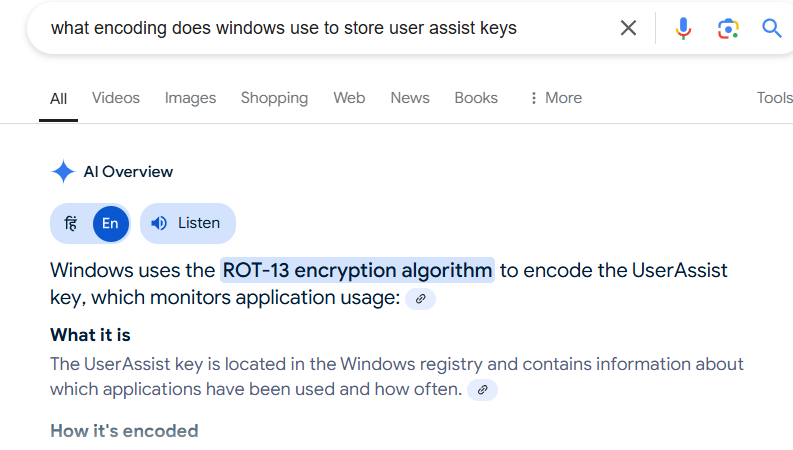

## **Challenge Name: Registry Keys... One For You, One For Me**  

### **Solves**  
- **Solves**: 748  
- **Points**: 150  

---

### **Description**  
Your team identified a rogue executable on a system. They figured out what user the executable was under and want you to check to see if the program was executed.  

To do that, you can use the **UserAssist keys** in the registry. They keep track of programs that have been executed. The only thing is that Windows stores the UserAssist keys encoded. Can you decode them?  

- `{1NP14R77-02R7-4R5Q-O744-2RO1NR5198O7}\abgrcnq.rkr`  
- `{1NP14R77-02R7-4R5Q-O744-2RO1NR5198O7}\Kwqjdy\cebtenzf_pna_eha_ohg_gurl_pnag_uvqr.rkr`  
- `{1NP14R77-02R7-4R5Q-O744-2RO1NR5198O7}\pzq.rkr`  

---

### **Approach**  

The key to solving this challenge lies in the statement, "Windows stores the UserAssist keys encoded."  

The encoding method used for UserAssist keys is **ROT13**. This substitution cipher shifts each letter by 13 places in the alphabet, making decoding straightforward.  



1. Decode the keys using ROT13:  
   - `abgrcnq.rkr` → `notepad.exe`  
   - `cebtenzf_pna_eha_ohg_gurl_pnag_uvqr.rkr` → `programs_can_run_but_they_cant_hide.exe`  
   - `pzq.rkr` → `cmd.exe`  

2. Out of these, the second decoded value, `programs_can_run_but_they_cant_hide.exe`, stands out as the answer.  

  

---

### **Answer**  
```
programs_can_run_but_they_cant_hide.exe
```  