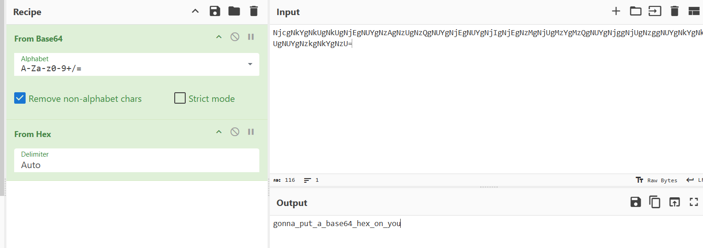

## **Challenge Name: Witch Spell**
### **Solves**
- **Solves**: 1698
- **Points**: 100

### **Description**  
Can you crack this code?

`NjcgNkYgNkUgNkUgNjEgNUYgNzAgNzUgNzQgNUYgNjEgNUYgNjIgNjEgNzMgNjUgMzYgMzQgNUYgNjggNjUgNzggNUYgNkYgNkUgNUYgNzkgNkYgNzU=`

---

### **Approach**

1.  **Let's Decode**:
    The `=` at the end of the given string hints that it's a Base64 Encoded string. Let's open Cyberchef and try to decode.

2. **Further Decoding**:
    After decoding from Base64, we get what looks like a Hex string, so we use the `From Hex` recipe.

    

3. **Answer**:
    - After decoding the hex, we get the answer:
     ```plaintext
     gonna_put_a_base64_hex_on_you
     ```

---

### **Answer**
```
gonna_put_a_base64_hex_on_you
```