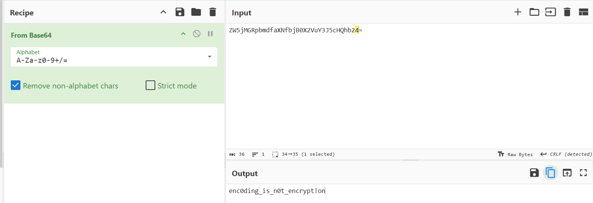

## **Challenge Name: Your Password? My Password**  

### **Solves**  
- **Solves**: 1072
- **Points**: 125

---

### **Description**  
During an incident, a threat actor can steal a database with the usernames and passwords of all of your application's users. The application developers say that all of the passwords were encrypted so there's nothing to worry about.

They send you an example of an "encrypted" password: `ZW5jMGRpbmdfaXNfbjB0X2VuY3J5cHQhb24=`

See if you're able to crack the password.
---

### **Approach**  

Now that we've seen this type of string so many time, they have trailing `=` characters, which are typically Base64 padding. Let's decode them using CyberChef.  

1. **Decoding the String**:  
   We use the From Base64 recipe and get the answer - `enc0ding_is_n0t_encrypt!on`.

   

---

### **Answer**  
```
enc0ding_is_n0t_encrypt!on
```  