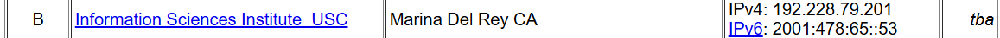

## **Challenge Name: DNS Trivia 1**
### **Solves**
- **Solves**: 2534
- **Points**: 25

### **Description**  
What root nameserver is located in Marina Del Rey, CA (just initial hostname)?
---

### **Approach**

1.  **Google Searching**:
    Simply paste the exact question on google or search engine of your choice.

    Looking at the Search Engine Result Page, I saw a website which had the exact name Marina Del Rey, CA - https://www.cybertelecom.org/dns/root_servers.htm

    I opened it up and found the Home Name ASN - `tba`. I entered the answer and got the points.

    

---

### **Answer**
```
tba
```