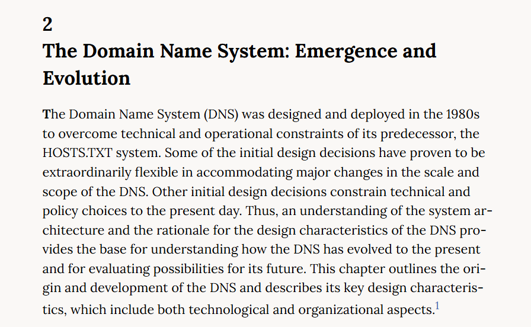

## **Challenge Name: DNS Trivia 2**
### **Solves**
- **Solves**: 2677
- **Points**: 25

### **Description**  
DNS was designed to replace what Unix file (one word, no path)?
---

### **Approach**

1.  **Search Engine Lookup**:
    Simply look up the question on google and you'll find the answer.

    I found this website gave an insight on the history of it - https://nap.nationalacademies.org/read/11258/chapter/4 and it said that the predecessor to DNS was `HOSTS.TXT`.

    

    So, that gives us our answer `Hosts`.
---

### **Answer**
```
Hosts
```