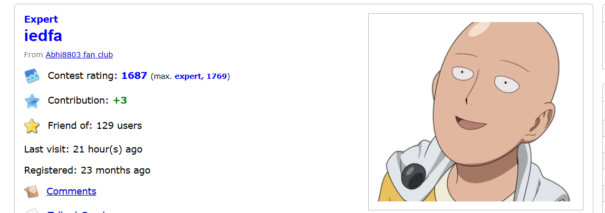
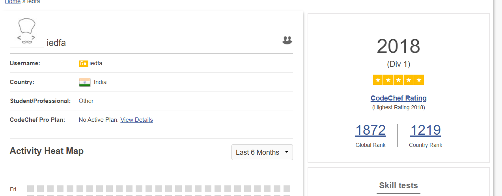

# Challenge Name: CP

## Description  
**Background Check**  
You have been asked by Sprinklr to do a background check on an intern candidate. The candidate's name is Arnav Kumar Sinha from IIT(BHU), Varanasi, India.  

**Objective**  
The candidate is a Competitive Programming enthusiast. Can you find his current and max rating on Codeforces and current rating on CodeChef.

**Flag Format**  
`CodefestCTF{currentCF_maxCF_currentCC}`  

## Writeup

### Codeforces Analysis
Profile: [codeforces.com/profile/iedfa](https://codeforces.com/profile/iedfa)  
  
- Current Rating: **1687**  
- Max Rating: **1769**

### Codechef Verification
Profile: [codechef.com/users/iedfa](https://www.codechef.com/users/iedfa)  
  
- Current Rating: **2018**

## Flag
`CodefestCTF{1687_1769_2018}`