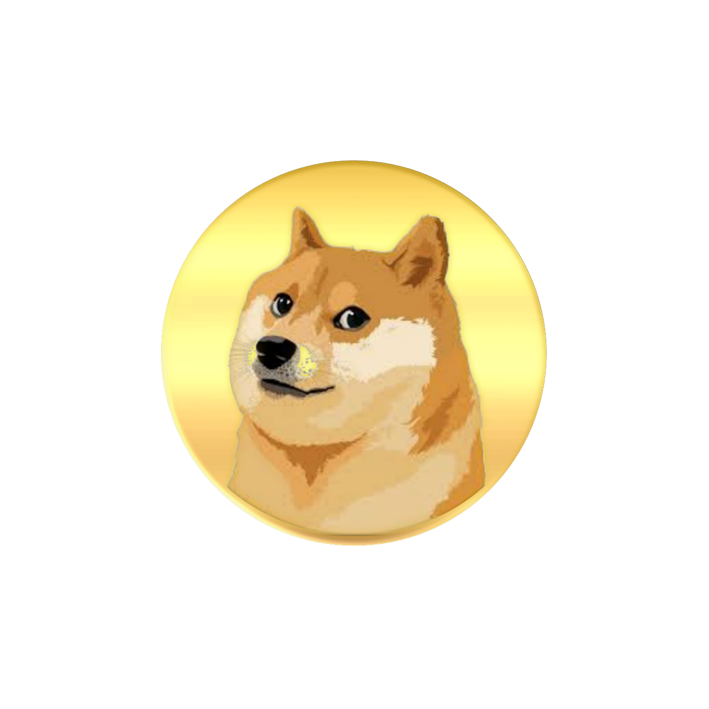

# Challenge Name: Dogecoin

**Files Provided:**  
[`chall.png`](./attachments/chall.jpg)  <!-- Note: File extension discrepancy -->

## Description

> "If DogeCoin had a counterfeit, this is probably it. Looks same but maybe isn't..."

## Writeup

### Initial Analysis


Verify file type:
```bash
┌──(kali㉿kali)-[~/Desktop/tmp]
└─$ file chall.png
chall.png: PNG image data, 1280 x 1280, 8-bit/color RGBA, non-interlaced
```

Visual inspection shows no obvious anomalies:
```bash
┌──(kali㉿kali)-[~/Desktop/tmp]
└─$ eog chall.png
```


### Steganography Investigation
Using `zsteg` with aggressive scanning:
```bash
┌──(kali㉿kali)-[~/Desktop/tmp]
└─$ zsteg -a chall.png

b1,r,lsb,xy         .. text: "}1xUPE2CL"
b1,rgb,lsb,xy       .. text: "INXWIZLGMVZXIQ2UIZ5TKMLNOBWDGX3MONRF6NJXGNTTAX3GOR3X2==="
```

### Cryptanalysis
The second string appears encoded:
```text
INXWIZLGMVZXIQ2UIZ5TKMLNOBWDGX3MONRF6NJXGNTTAX3GOR3X2===
```

Using [dcode.fr](https://www.dcode.fr/cipher-identifier):
1. Identified as Base32 encoding
2. Decoded result: `CodefestCTF{51mpl3_lsb_573g0_ftw}`

## Flag
`CodefestCTF{51mpl3_lsb_573g0_ftw}`

---
