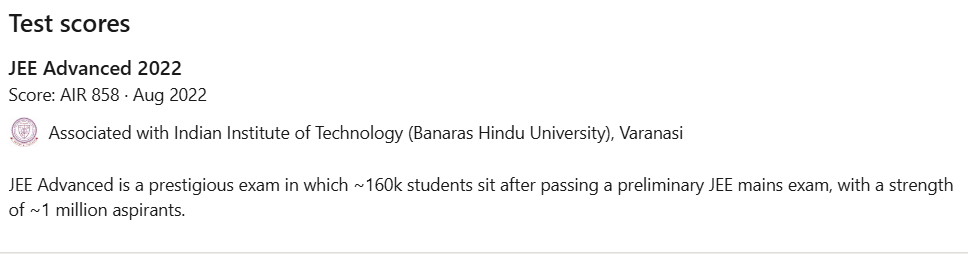

# Challenge Name: JEE Advanced Ranking

## Description  
**Background Check**  
You have been asked by Sprinklr to do a background check on an intern candidate. The candidate's name is Arnav Kumar Sinha from IIT(BHU), Varanasi, India.  

**Objective**  
Confirm the candidate's JEE Advanced performance for Sprinklr's intern background check. 

**Flag Format**  
`CodefestCTF{year_rank}`  

## Writeup

### LinkedIn Profile Analysis
Profile: [linkedin.com/in/iedfa](https://www.linkedin.com/in/iedfa)  
  

### Key Findings
- **Test Date:** August 2022  
- **All India Rank (AIR):** 858  

## Flag
`CodefestCTF{2022_858}`

---
