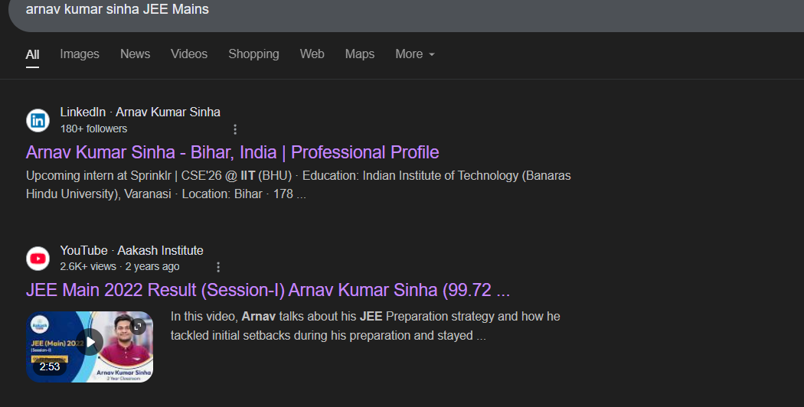

# Challenge Name: JEE Main

## Description  
You have been asked by Sprinklr to do a background check on an intern candidate. The candidate's name is `Arnav Kumar Sinha` and he's from IIT(BHU), Varanasi, India.
Help the company!

**Objective**  
Can you find the candidate's percentile in JEE Main?

**Flag Format**  
`CodefestCTF{XX.XX}`  

## Writeup

### Digital Footprint Analysis
1. Searched: `"Arnav Kumar Sinha" JEE Main 2022`  
2. Identified official result announcement video:  
   [JEE Main 2022 Toppers](https://www.youtube.com/watch?v=V4a5fzL33t0)

### Evidence Extraction
  
- Candidate listed with **99.72** percentile

## Flag
`CodefestCTF{99.72}`

---