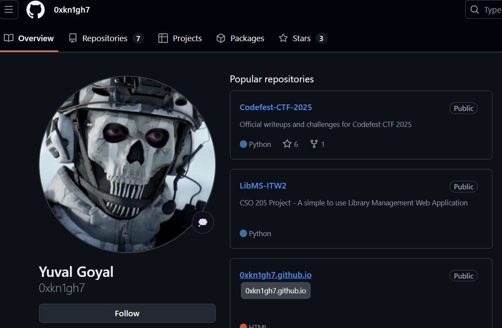
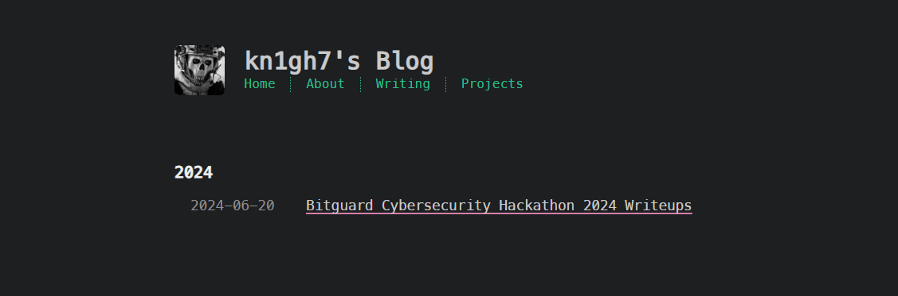
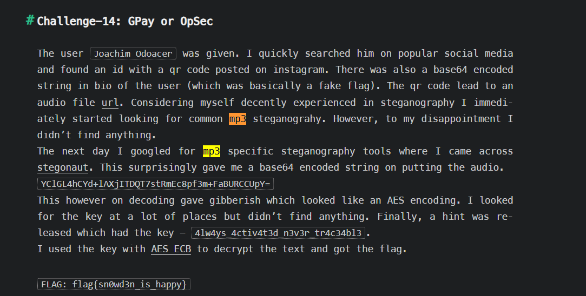
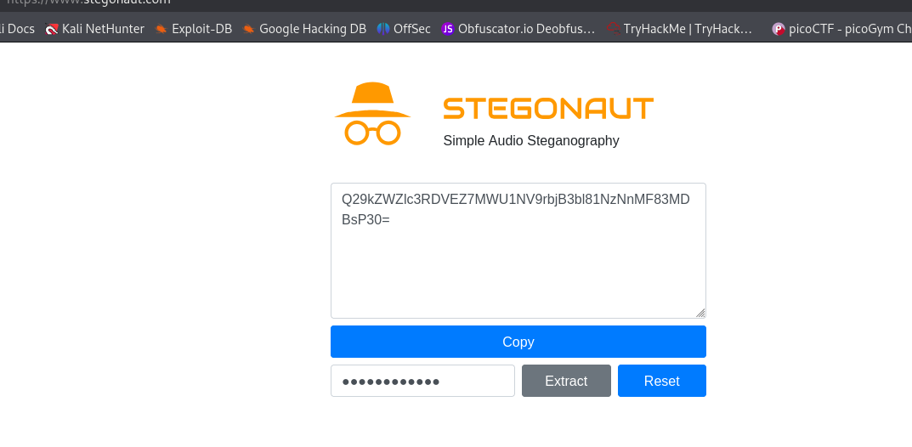

# Challenge Name: RickRoll

**Files Provided:**  
[`chall.zip`](./attachment/chall.zip)

## Description
> "This song is actually pretty good. Anyways while giving CTFs I came across a rare tool I had never heard of. Pretty sure I would have documented this somewhere."

## Writeup

### Initial Analysis
Extract the archive contents:

```bash
┌──(kali㉿kali)-[~/Desktop/tmp]
└─$ unzip chall.zip
Archive:  chall.zip
  inflating: chall.mp3               
  inflating: cover.jpg
```

### File Investigation
1. **Image Analysis** with exiftool:
```bash
┌──(kali㉿kali)-[~/Desktop/tmp]
└─$ exiftool cover.jpg
[...]
Artist                          : giveupplease
[...]
```

2. **Audio Analysis**:
- Spectrogram analysis in Audacity revealed no anomalies
- Basic steganalysis tools (steghide, stegseek) showed no results

### Author Research
The artist name "giveupplease" and challenge hint led to investigating the username `0xkn1gh7`:

- GitHub Profile: [https://github.com/0xkn1gh7](https://github.com/0xkn1gh7)
- Personal Portfolio: [https://0xkn1gh7.com/](https://0xkn1gh7.com/)



Found writeup mentioning **[Stegonaut](https://www.stegonaut.com/)**:


### Hidden Data Extraction
Using Stegonaut with `giveupplease` as the password:



### Flag Decoding
Base64 decode the extracted string:
```bash
┌──(kali㉿kali)-[~/Desktop/tmp]
└─$ echo "Q29kZWZlc3RDVEZ7MWU1NV9rbjB3bl81NzNnMF83MDBsP30=" | base64 -d
CodefestCTF{1e55_kn0wn_573g0_700l?}
```

## Flag
`CodefestCTF{1e55_kn0wn_573g0_700l?}`

---
