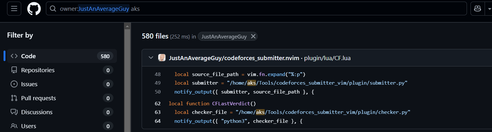
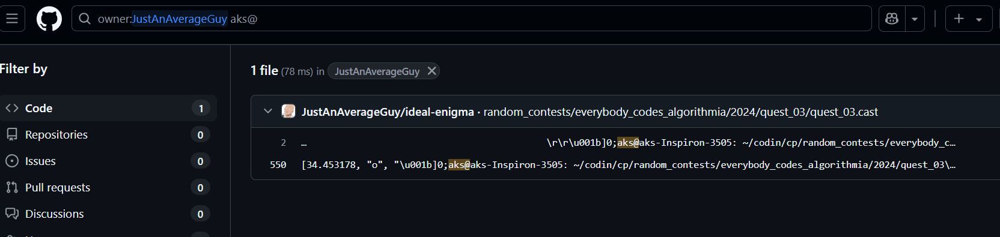

# Challenge Name: Why do they even need this?

## Description
You have been asked by Sprinklr to do a background check on an intern candidate. The candidate's name is `Arnav Kumar Sinha` and he's from IIT(BHU), Varanasi, India.
Help the company!

**Objective**  
Can you find the candidate's laptop's user and hostname?

**Flag Format**  
`CodefestCTF{username_hostname}`

## Writeup

### Username Discovery
1. Investigated the [author's profile page](https://iitbhucybersec.in/authors/iedfa/) showing aliases:
   - rasimhankunrava
   - nirvana

2. Found code repository screenshot revealing Linux file path:
   ```python
   local submitter = "/home/aks/Tools/codeforces_submitter_vim/plugin/submitter.py"
   ```
   

**Username Identified:** `aks`

### Hostname Identification
1. Searched for Linux terminal patterns containing `aks@` (username@hostname format):
   
2. Found terminal screenshot with ANSI escape code:
   ```
   \u001b]0;aks@aks-Inspiron-3505: ~/codin/cp/...
   ```
   

**Hostname Identified:** `aks-Inspiron-3505`

## Flag
`CodefestCTF{aks_aks-Inspiron-3505}`

---
