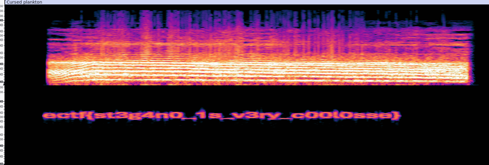

# Steganography CTF Challenge: "Chill Plankton"

## Challenge Overview
We were given a ZIP file named **[Stega_2_-_Im_just_a_chill_guy.zip](Resources/Stega_2_-_Im_just_a_chill_guy.zip)** containing an MP3 file.

## Step 1: Unzipping the Archive
The first step was to extract the contents:
```bash
┌──(kali㉿kali)-[~/Desktop/tmp]
└─$ unzip Stega_2_-_Im_just_a_chill_guy.zip
Archive:  Stega_2_-_Im_just_a_chill_guy.zip
  inflating: Stega_2_-_Im_just_a_chill_guy.mp3
```

## Step 2: Checking File Information
We used the `file` command to analyze the MP3 file:
```bash
┌──(kali㉿kali)-[~/Desktop/tmp]
└─$ file Stega_2_-_Im_just_a_chill_guy.mp3
Stega_2_-_Im_just_a_chill_guy.mp3: Audio file with ID3 version 2.3.0, contains: MPEG ADTS, layer III, v1, 128 kbps, 44.1 kHz, JntStereo
```
This confirmed that it is a valid MP3 file.

Next, we extracted metadata using `exiftool`:
```bash
┌──(kali㉿kali)-[~/Desktop/tmp]
└─$ exiftool Stega_2_-_Im_just_a_chill_guy.mp3
ExifTool Version Number         : 13.00
File Name                       : Stega_2_-_Im_just_a_chill_guy.mp3
File Size                       : 3.3 MB
File Type                       : MP3
MIME Type                       : audio/mpeg
Encoder                         : LAME3.100
Title                           : You’re just a chill guy listening to chill music
Artist                          : BeatsBySalty
Txxx                            : https://www.youtube.com/watch?v=UMbPNU_GyTU
```

### Step 3: Investigating the YouTube Link
The metadata contained a YouTube link: [https://www.youtube.com/watch?v=UMbPNU_GyTU](https://www.youtube.com/watch?v=UMbPNU_GyTU). However, after analyzing the video, there were no apparent clues.

### Step 4: Listening to the Audio
Playing the MP3 file in **Audacity**, the last three words in the audio were clearly heard: **"Capital W, Capital S, Capital K"**.

### Step 5: Extracting Hidden Information
By carefully re-listening, a code **"8xUue4E4WSA"** was discovered. Testing it as a YouTube video ID by visiting [https://www.youtube.com/watch?v=8xUue4E4WSA](https://www.youtube.com/watch?v=8xUue4E4WSA), we found another video.

### Step 6: Extracting the Hidden Data from the New Audio
Downloading the audio from the new YouTube video:
```bash
youtube-dl -x --audio-format mp3 https://www.youtube.com/watch?v=8xUue4E4WSA
```

### Step 7: Analyzing with Spectrogram
Opening the downloaded MP3 in **Audacity** and switching to the **Spectrogram** view, we discovered the hidden text.




### Flag
```
ectf{st3g4n0_1s_v3ry_c00l0sse}
```

---