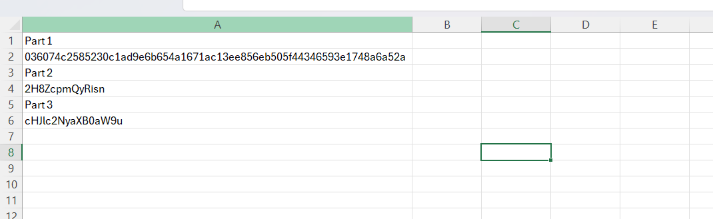
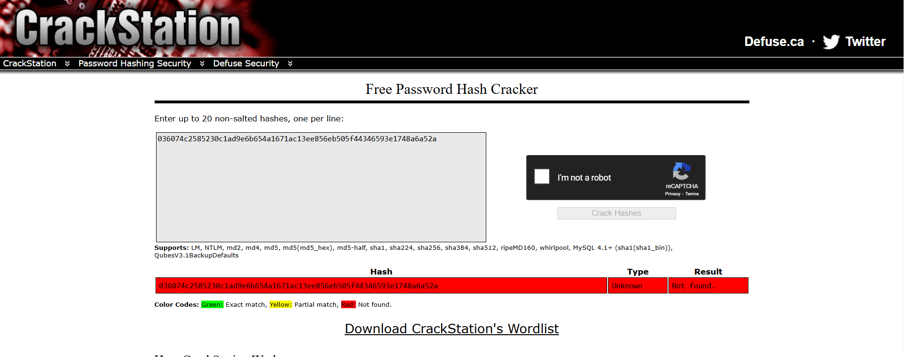
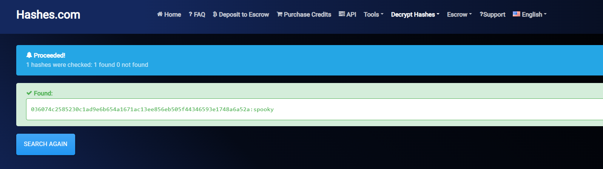
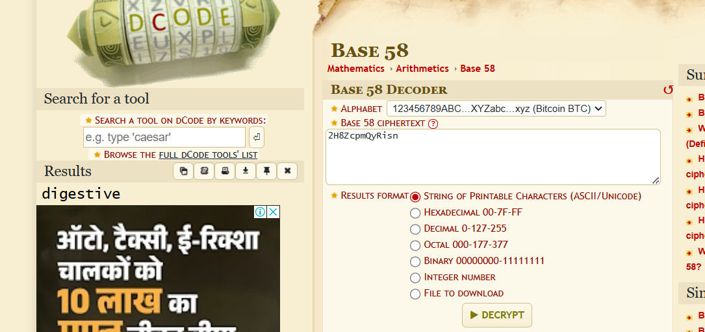

## **Challenge Name**: Hashes Binder

---

### Description

You are given a zip file named `Crypto_-_Hashes_Binder.zip`, which contains a few encrypted files. The task is to recover a forgotten main password and several other passwords stored in an Excel file. The challenge requires you to decrypt the Excel file first, and then use the passwords stored in it to unlock an encrypted archive and retrieve the flag.

The flag format is: `ECTF{the_code}`.

#### Files Provided:
[Crypto_-_Hashes_Binder.zip](Resources/Crypto_-_Hashes_Binder.zip)

---

### Steps to Solve

#### Step 1: Unzipping the File

After unzipping the given zip file `Crypto_-_Hashes_Binder.zip`, we get three files:

```bash
┌──(root㉿kali)-[/home/kali/Desktop/tmp]
└─# unzip Crypto_-_Hashes_Binder.zip 
Archive:  Crypto_-_Hashes_Binder.zip
  inflating: Format:excelPassword_Part1_Part2_Part3.zip  
  inflating: parts.xlsx              
  inflating: wordlist.txt 
```

The three files are:
1. `Format:excelPassword_Part1_Part2_Part3.zip` — an encrypted archive.
2. `parts.xlsx` — an Excel file that we need to crack to recover the passwords.
3. `wordlist.txt` — a wordlist to assist in cracking the passwords.

---

#### Step 2: Cracking the Excel Password

The first step is to crack the password for the Excel file `parts.xlsx`. We use the `office2john` tool to generate the hash of the Excel file, which we then crack using `john` with the `wordlist.txt` file.

```bash
┌──(root㉿kali)-[/home/kali/Desktop/tmp]
└─# john hash_xlsx --wordlist=wordlist.txt 
```

After a short time, `john` cracks the password:

```bash
dolphin          (parts.xlsx)     
```

The cracked password for the Excel file is `dolphin`.

---



#### Step 3: Extracting Password Parts

We now open the `parts.xlsx` file using the password `dolphin` and retrieve three parts of the password:

- **Part 1**: `036074c2585230c1ad9e6b654a1671ac13ee856eb505f44346593e1748a6a52a`
- **Part 2**: `2H8ZcpmQyRisn`
- **Part 3**: `cHJlc2NyaXB0aW9u`

---

#### Step 4: Cracking Part 1

Part 1 looks like a hashed password. We attempt to crack it using CrackStation, but it doesn't work.



Then, we try `hashes.com` and successfully crack Part 1:

```bash
Part 1/3 - `spooky`
```



---

#### Step 5: Decoding Part 2

Part 2 appears to be in an unknown format, so we use dcode.fr's cipher identifier to find the correct format. After testing various possibilities, we identify it as Base58 encoding and decode it:



```bash
Part 2/3 - `digestive`
```

---

#### Step 6: Decoding Part 3

Part 3 looks like Base64 encoding. We use CyberChef to decode it and get the plaintext:

```bash
# Base64 decode gives us Part 3
Part 3/3 - `prescription`
```

---

#### Step 7: Assembling the Full Password

Now that we have all three parts, we assemble them according to the format provided:

```bash
Format:excelPassword_Part1_Part2_Part3.zip
```

The password for the archive is:

```bash
dolphin_spooky_digestive_prescription
```

---

#### Step 8: Unlocking the Archive

Using the password `dolphin_spooky_digestive_prescription`, we successfully unlock the archive `Format:excelPassword_Part1_Part2_Part3.zip` and obtain the flag.

---

### Flag

The flag is: `ECTF{J0nH_tH3_Cr4ck3R_95234826}`

---
