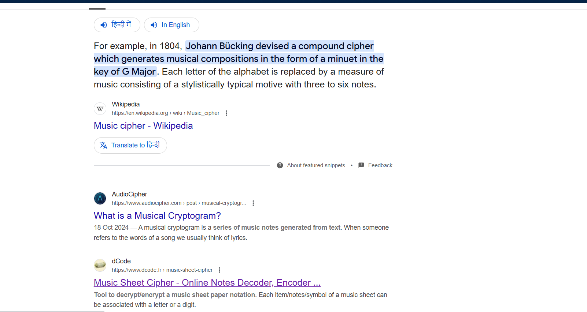
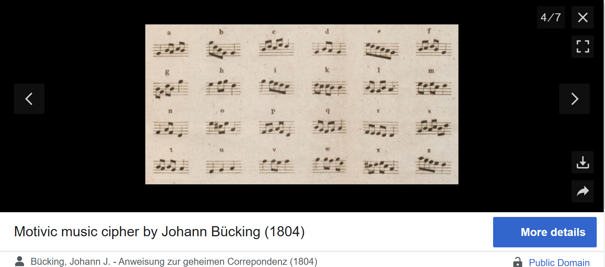

# **Challenge Name: JB1804**  

## **Challenge Overview**  
We are given an image file and a hint related to music. Our task is to extract a hidden message from it.  

**Flag format:** `ectf{xxx}`  
**Note:** No spaces in the flag.  

### **Files Provided**  
- `Stega_4_-_JB1804.zip` (contains `Stega_4_-_JB1804.png`)  

---

## **Solution**  

### **Step 1: Extracting the File**  
First, we unzip the provided archive:  

```bash
unzip Stega_4_-_JB1804.zip
```
This gives us a single image file:  

```bash
ls
Stega_4_-_JB1804.png
```

---

### **Step 2: Analyzing the Image**  
Let's check the file type:  

```bash
file Stega_4_-_JB1804.png
```

**Output:**  
```
Stega_4_-_JB1804.png: PNG image data, 971 x 470, 8-bit/color RGBA, non-interlaced
```
Opening the image, we see **musical notes** on a **sheet music background**. This suggests that the text might be encoded using a **musical cipher**.  

---

### **Step 3: Checking for Hidden Metadata**  
#### **Exif Metadata Analysis**  
We run `exiftool` to check for any hidden metadata:  

```bash
exiftool Stega_4_-_JB1804.png
```
**Output (trimmed):**  
```
File Type                       : PNG
Image Width                     : 971
Image Height                    : 470
Bit Depth                       : 8
Warning                         : [minor] Text/EXIF chunk(s) found after PNG IDAT
```
There are some additional chunks of data, but nothing significant for extraction.

---

### **Step 4: Running Binwalk for Hidden Data**  
To check for hidden files, we run `binwalk`:  

```bash
binwalk Stega_4_-_JB1804.png
```
**Output:**  
```
DECIMAL       HEXADECIMAL     DESCRIPTION
--------------------------------------------------------------------------------
0             0x0             PNG image, 971 x 470, 8-bit/color RGBA, non-interlaced
91            0x5B            Zlib compressed data, compressed
59639         0xE8F7          TIFF image data, big-endian, offset of first image directory: 8
```
No embedded files or archives were found. This confirms that the steganography is likely within the **visible musical notes**.

---

### **Step 5: Identifying the Cipher**  
Since the challenge hint mentions "JB1804" and we see **musical notes**, a quick search leads us to **Music Sheet Ciphers**.  



Using **dCode's Music Sheet Cipher decoder** ([dCode](https://www.dcode.fr/music-sheet-cipher)), or we can manually match the notes to letters using the following mapping.



#### **Decoding the Musical Notes**  
Using the **Music Sheet Cipher mapping**, we extract the following:  

```
ectf{steganomousiqueissuperswag}
```

---

## **Final Flag**  
```
ectf{steganomousiqueissuperswag}
```
---