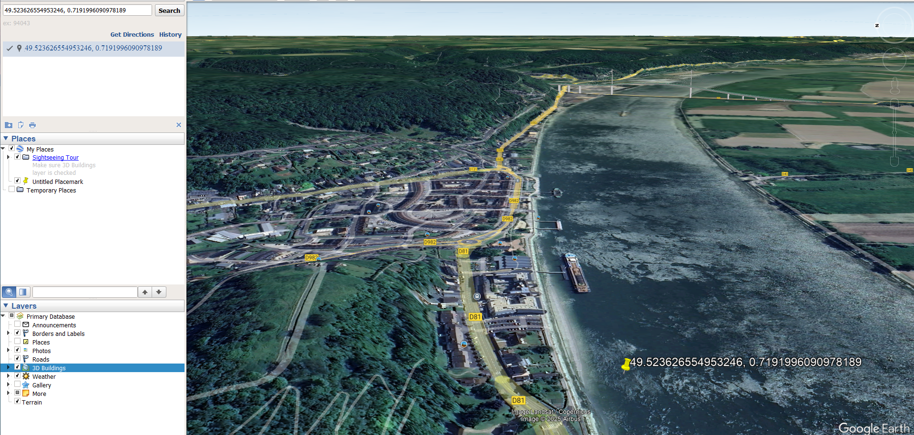

# PNJ - 1 - Bridge

## Description
I have a friend who's a bridge fan, so I take a lot of photos of his favorite bridges during my vacations. On my latest trip, I took a photo of a not-so-famous bridge, but it looked absolutely stunning in the morning mist. Help me figure out where I took the photo.

**Flag format:** `ectf{town-name}`

**File:**  
[OSINT_2_-_Travel.zip](Resources/OSINT_2_-_Travel.zip)

---

## Solution
1. **Step 1: Analyze the Images**

   - **Image 7**: The Tancarville Bridge was found.  

   - **Image 8**: The Pont De Normandie Bridge was located.  

   - **Image 9**: The photo shows La Plage Le Havre, France, with the following coordinates:
     - **Coordinates**: 50° 41′ 56.8″ N, 7° 10′ 3.73″ E → **50.6991° N, 7.1677° E**  

2. **Step 2: Inspect Image 6**
   
   - **Mantes-la-Jolie** is visible in Image 6, situated along the Seine River.  
   
   - The bridge shown is the **Rue nationale** bridge (D893A), but it didn’t seem to match the description completely.

3. **Step 3: Locate the Bridge**
   
   - Based on the image’s ferry proximity and the specific details, I identified the location of **Pont de Brotonne North**:
     - **Coordinates**: 49.5205303, 0.7447086
     - This led me to **Pont de Brotonne**, a bridge in Normandy, France.  
     

   - The Brotonne Bridge spans the Seine River between **Le Havre** and **Rouen**.
   
4. **Step 4: Narrow Down the Towns**

   - Possible towns: 
     - **Le Havre**
     - **Rouen**
     - **Rives-en-Seine**
     - **Caudebec-en-Caux**
     - **Normandy**
   
   After thorough investigation, the most likely town where the photo was taken is **Caudebec-en-Caux**, based on nearby landmarks and the bridge’s location.

## Flag

`ectf{caudebec-en-caux}`
