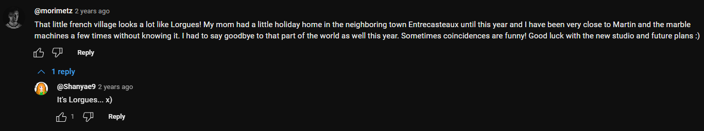

---

## **Challenge Name: project-153-Bonus-2**

### **Description**

Did you know that Wintergatan wasn't very far?  
Which village was he in?  
[YouTube Video](https://www.youtube.com/watch?v=0BB4Y_OuBUQ)  
Flag format: ectf{Name}

---

### **Approach**

1. **Watch the Video**  
   - Go to the video linked in the challenge description.

2. **Check Transcript**  
   - Look through the transcript for any mentions of the village name, but there is **no mention** of it directly.

3. **Scan the Comments**  
   - Scroll down to the comment section of the video and search for the word **"village"** using **CTRL+F**.



4. **Find the Village**  
   - After searching, a comment mentions that Wintergatan was in **Lorgues**.

5. **Final Solution**  
   - The flag is the name of the village, formatted as:

   ```
   ectf{Lorgues}
   ```

---

### **Flag**

`ectf{Lorgues}`

---