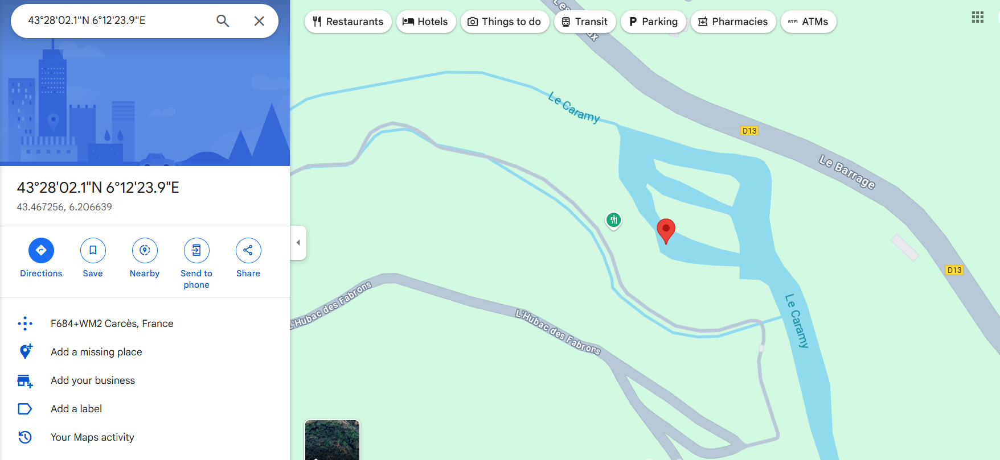

## **Challenge Name: Project-153-Q1**

### **Description**

Thomas Yatangaki: Have you ever visited this place? I can't remember the name...  
Maboi 💪: Me neither 😕  
Flag format: ectf{Name_of_the_Place} (in French)

**Files:**  
[OSINT_1_-_question-1.zip](Resources/OSINT_1_-_question-1.zip)

---

### **Approach**

1. **Observation**  
   - The challenge seems to be related to OSINT (Open-Source Intelligence), with a focus on an image that contains metadata.
   - The description provided hints that the place's name might be tied to the location's coordinates found in the image.

2. **Decoding Logic**  
   - We start by analyzing the image file's metadata to extract GPS coordinates using `exiftool`.
   - The image's metadata contains GPS coordinates:
     - **Latitude:** 43° 28' 2.00" N
     - **Longitude:** 6° 12' 23.90" E
   - These coordinates point to a location in the vicinity of the "Cascades de Caramy" in France.

3. **Step-by-Step Decryption**  
   - After extracting the GPS data from the image, we can plot the coordinates on a map to identify the place. The GPS location corresponds to a waterfall area named "Cascades de Caramy" near the town of Caramy.
   
   - The coordinates are as follows:  
     - **Latitude:** 43.467256° N  
     - **Longitude:** 6.206639° E  

     
   
   - Initially, the guess for the name of the place was "Le Caramy," but that didn't work for the flag format.
   - After adjusting the guess to "Cascades de Caramy," the correct flag was obtained.

   - **Flag format:**  
     ```
     ectf{Cascades_de_Caramy}
     ```

---

### **Flag**

`ectf{Cascades_de_Caramy}`

---