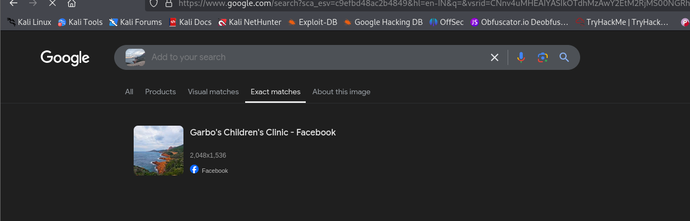

## **Challenge Name: Project-153-Q2**

### **Description**

Thomas Yatangaki: Did you know that the exact position where I took the photo had a name? It is such an interesting place full of history 😮.  
Flag format: ectf{Name_of_the_Place} (in French)

**Files:**  
[OSINT_1_-_question-2.zip](Resources/OSINT_1_-_question-2.zip)

---

### **Approach**

1. **Observation**  
   - The task involves analyzing the image metadata to identify a location.
   - There is no immediate clue in the EXIF metadata, so additional steps like reverse image search are essential.
   - The flag format indicates that the name of the place should be in French.


2. **Decoding Logic**  
   - The image metadata is analyzed using `exiftool`, which reveals no immediate clues.
   - The next step is a reverse image lookup using Google, which provides valuable information about the location.
   - The location identified through the reverse image lookup is **Massif de l'Esterel** on the French Riviera, but this is not the correct flag.
   - Further investigation using Google Maps led to a more accurate location: **Pointe de l'Observatoire**.



3. **Step-by-Step Decryption**  
   - **Reverse Image Lookup Result:** The image is associated with **Massif de l'Esterel**.
   - While this is a close match, it's not the flag.
   - After exploring further with Google Maps, we identified a location near the coordinates **43.4482244, 6.9179548**, which leads us to the **Pointe de l'Observatoire**.
   
   - **Flag format:**  
     ```
     ectf{Pointe_de_l'Observatoire}
     ```

---

### **Flag**

`ectf{Pointe_de_l'Observatoire}`

---