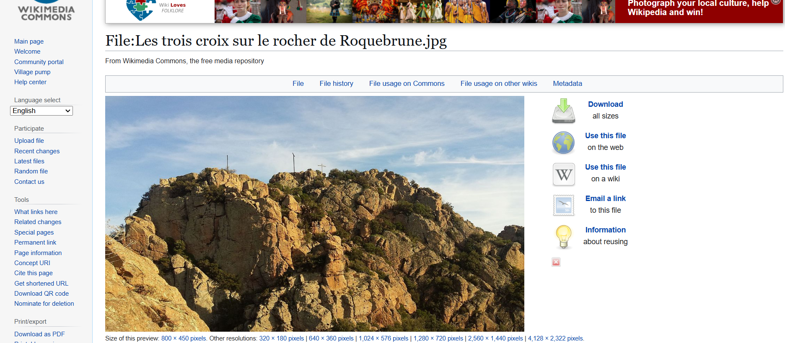
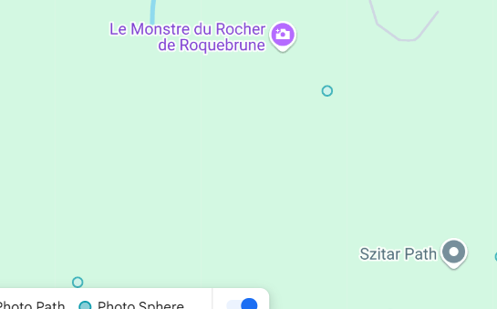

Certainly! Here's the solution with the images in the same places:

---

## **Challenge Name: Project-153-Q3**

### **Description**

Thomas Yatangaki: Bro, check the picture I took last time.  
Btw, I just checked, and apparently, there was a monster near us 🙀 Do you know who took the photo of the monster?  
Flag format: ectf{Firstname_LASTNAME}

**Files:**  
[OSINT_1_-_question-3.zip](Resources/OSINT_1_-_question-3.zip)

---

### **Approach**

1. **Observation**  
   - The challenge involves identifying the photographer of an image, which contains a reference to a "monster."
   - The flag format requires the photographer's name in the form **Firstname_LASTNAME**.

2. **Decoding Process**  
   - The initial step involves analyzing the image file with the `file` and `exiftool` commands. The EXIF metadata doesn't provide any specific information about the photographer, so further steps like reverse image search are necessary.
   - A **reverse image search** reveals the location depicted in the image is related to **Rocher de Roquebrune**, a rock formation. From there, a specific landmark **Le Monstre du Rocher de Roquebrune** is identified as the place related to the "monster."
   
   

   - The location **43.4488653,6.6041042** seems close but not the right perspective/direction.

   

   - The image search leads to the discovery of a person associated with reviews on the spot: **Rob en Inge Legius**, but they are not the photographer.

3. **Final Discovery**  
   After further investigation, the landmark **Le Monstre du Rocher de Roquebrune** is identified, and the photographer's name **Michael Delaeter** is confirmed.

4. **Flag Format**  
   The flag format indicates that we need the photographer’s name in the format `ectf{Firstname_LASTNAME}`, which gives us:

   ```
   ectf{Michael_DELAETER}
   ```

---

### **Flag**

`ectf{Michael_DELAETER}`

---