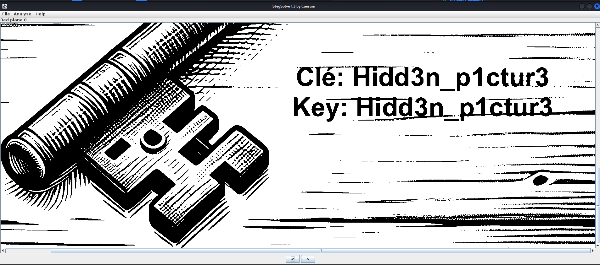
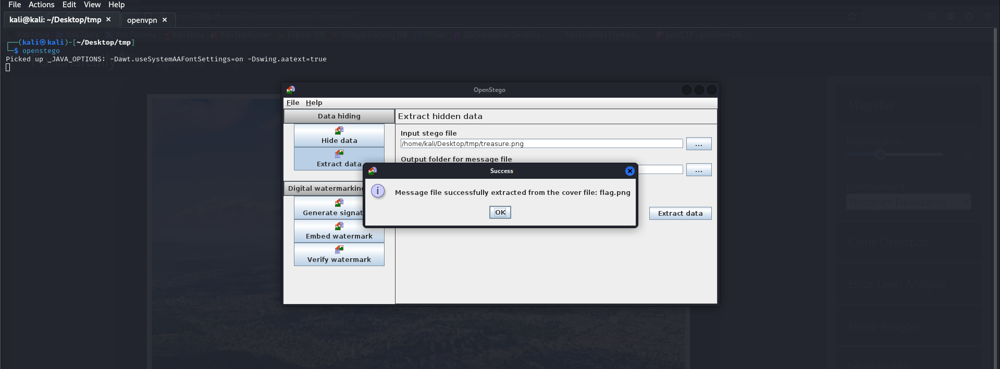

### **Challenge Name**: The Island's Treasure

---

### **Description**:

We've found a chest on an island, but it's locked with 2 padlocks.  
The 2 keys are hidden somewhere on the island. Find them, and you can open the chest and get the treasure.

**Chest opening code format**: key1:key2  
**Flag format**: `ECTF{....}`

---

### **Files**:

- [Stega_-_The_islands_treasure.zip](Resources/Stega_-_The_islands_treasure.zip)

---

### **Solution**:

```bash
┌──(kali㉿kali)-[~/Desktop/tmp]
└─$ unzip Stega_-_The_islands_treasure.zip 
Archive:  Stega_-_The_islands_treasure.zip
  inflating: island.png               
  inflating: treasure.png            
                                                                                                                                                                                                                                            
┌──(kali㉿kali)-[~/Desktop/tmp]
└─$ ls
island.png  Stega_-_The_islands_treasure.zip  treasure.png
```

We begin by unzipping the provided archive and viewing the files.

```bash
┌──(kali㉿kali)-[~/Desktop/tmp]
└─$ zsteg island.png 
meta Description    .. text: "UnNPcGJHbGphWFJoZEdsdmJuTWdJU0JVZFNCaGN5QjBjbTkxZHNPcElHeGhJR05zdzZrZ2JzS3dNU0JrZFNCamIyWm1jbVVnSVEwS1EyOXVaM0poZEhWc1lYUnBiMjV6SUNFZ1dXOTFJR1p2ZFc1a0lIUm9aU0JyWlhrZ2JzS3dNU0J2WmlCMGFHVWdZMmhsYzNRZ0lRMEtRMnpEcVRvZ1RUTjBOR1EwZERSZk1UVmZiakIwWHpWaFpqTU5Da3RsZVRvZ1RUTjBOR1EwZERSZk1UVmZiakIwWHpWaFpqTT0="
```

The `zsteg` tool reveals a base64 encoded string. We decode it twice:

```bash
Félicitations ! Tu as trouvé la clé n°1 du coffre !
Congratulations ! You found the key n°1 of the chest !
Clé: M3t4d4t4_15_n0t_5af3
Key: M3t4d4t4_15_n0t_5af3
```

The first key is `M3t4d4t4_15_n0t_5af3`.

Next, I tried `binwalk` and `openstego`, but neither worked. Using `stegsolve`, we find the second key hidden in the image.



The second key is `Hidd3n_p1ctur3`.

### **Final Key**:
The combined keys are:  
`M3t4d4t4_15_n0t_5af3:Hidd3n_p1ctur3`

Now, we can use this key to extract the flag from the `treasure.png` file using `openstego`.



It works! We open [`flag.png`](Resources/flag.png) and retrieve the flag.

---

### **Flag**:

```
ECTF{You_found_th3_tr3asur3}
```

---