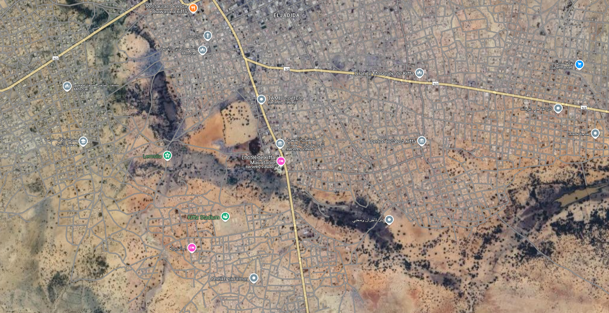
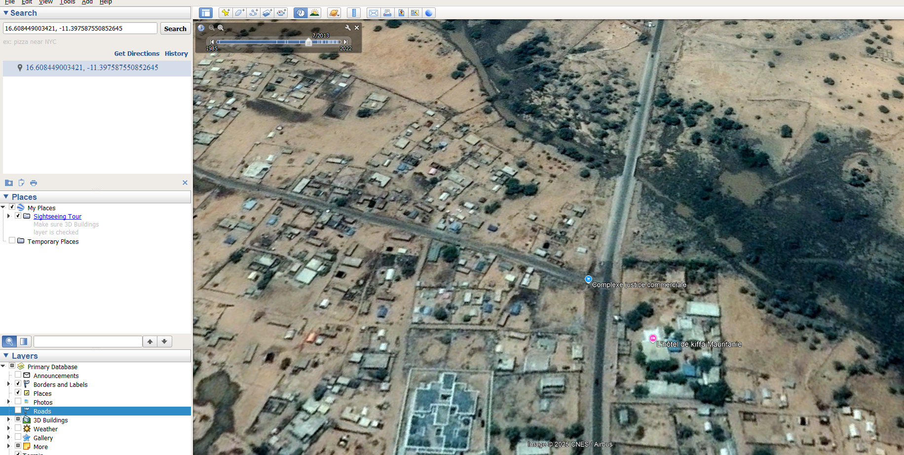
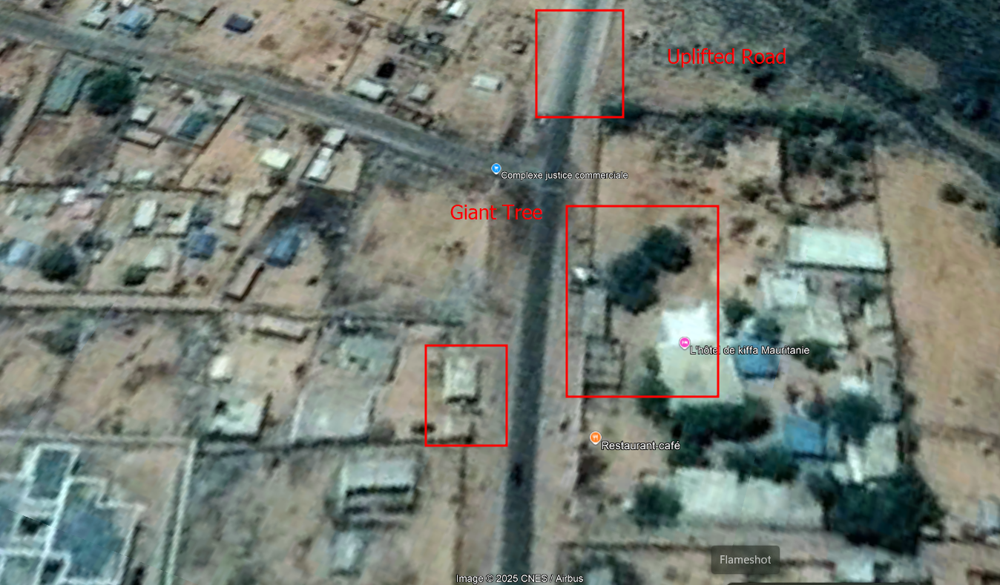

# **OSINT Exercise #001**

---

## **Description**

Below is a screenshot from a tweet containing a photo. The image contains all the relevant information necessary to determine the exact location where it was taken. Your task is to identify the coordinates of the location.

For the photo without the Twitter border, click [here](https://gralhix.com/wp-content/uploads/2023/08/osint-exercise-001-big-picture.jpeg).

### **Exercise Difficulty**
- **For beginners:** Hard  
- **For experts:** Medium  

  
*Note: I do not own this photo; it is used here strictly for educational purposes.*

---

## **Solution**

### **Key Observations**
- The tweet is in Arabic, indicating an Arabic-speaking country.
- The text mentions "Kiffa," which refers to a city in Mauritania.
- The timestamp on the tweet is **February 20, 2013, at 1:45 PM**.

### **Image Analysis & Verification**
#### **Reverse Image Lookup**
- Performing a reverse image search yields no results on Google Image Search or TinEye, except for some medium blog posts.
- The text in the tweet translates to:
  > *In the morning, the cities display their beauty and present themselves to newcomers… The beautiful city of Kiffa has shown its virtues this morning!*

#### **Directional Analysis**
- The sun's rays are coming from the **left** side of the image.
- Since the author mentions "morning," we can conclude that the camera is facing **south**.
- There is only one major road in Kiffa, **the N3 highway**.

### **Pinpointing the Location**
- Based on the direction and landmarks, the author is standing **north of the city** while facing **south**.
- We can see:
  - A main road (N3) leading south.
  - Trees in the center of the road area.
  - A distinct large tree behind a building on the right.

Using **Google Earth Pro**, we go back to imagery from **July 2013** to compare terrain and verify landmarks.

#### **Cross-Referencing with Historical Satellite Imagery**
1. Open **Google Earth Pro** and enter suspected coordinates.
2. Use the **time-travel feature** to navigate back to July 2013.



3. Verify the distinct **large tree and building positions**.
4. Observe the **wide separation** between the paved road and buildings.



### **Final Confirmation**
With all these observations matching, we confirm the exact location.



---

## **Final Coordinates**
**16°36'33.93"N, 11°23'52.12"W**  
**Decimal Format:** `16.609425305445065, -11.397809762582632`

### **Simplified Coordinates:**
```
16.609, -11.397
```
---

Co-author: @atsggx