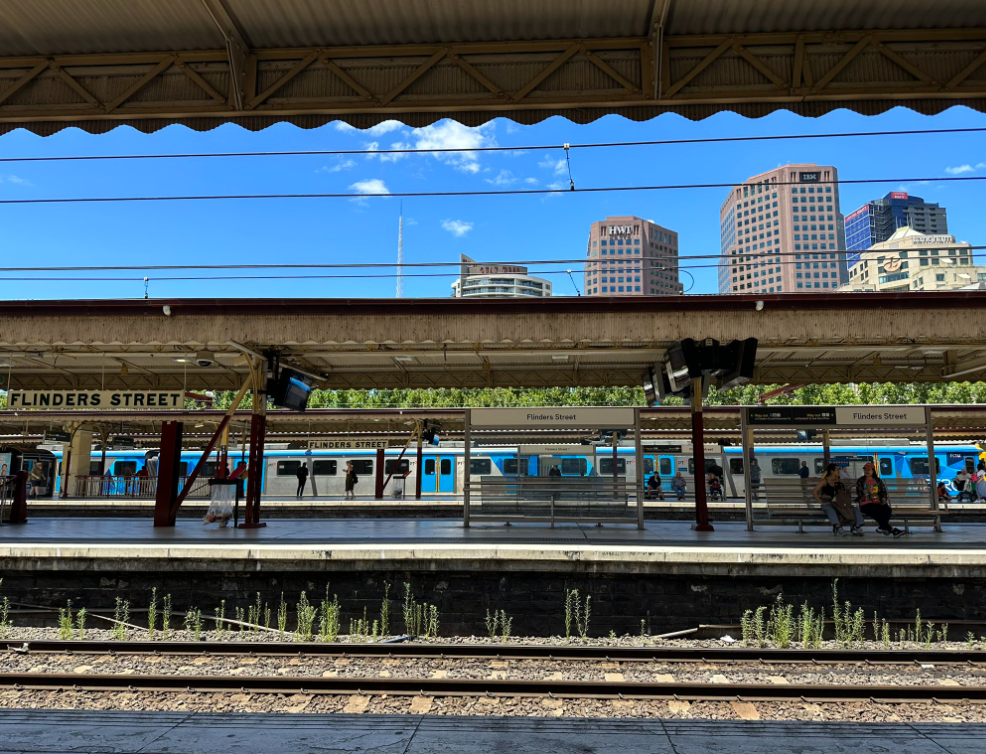

# **OSINT Exercise #002**

---

## **Description**

The photo below was shared on social media. It clearly depicts a train station. Please answer the following questions:

- **a)** What is the name of the train station seen in the photo?
- **b)** What is the name and height of the tallest structure seen in the photo?

Click [here](Resources/osint-exercise-002-big-picture.png) to open the photo on a new page.

**Note:** I did not take this photo or own the rights for it. It is only here to be used for educational purposes.

---

## **Solution**

### **Step 1: Identifying the Train Station**

The train station is clearly visible in the image. Upon close examination, we can recognize it as **Flinders Street Train Station**.

### **Step 2: Identifying the Tallest Building**

Observing the buildings in the background, we notice one prominently marked with **"HWT"**. A quick search for *HWT Flinders Street Train Station* confirms its location near the station. 

To the right of this building, we can spot **IBM Australia, located at 60 City Rd, Southbank VIC 3006, Australia**. This structure appears to be one of the tallest in the image. A simple search reveals:

- **IBM Australia Centre** in Melbourne, Australia is **131 meters (430 feet) tall** and has **34 floors**.

However, another building with a **red banner** displaying *"Central Equity"* appears possibly taller. Searching for this on Google leads us to **FOCUS Apartments by Central Equity**, which has a confirmed height of **167 meters**.

---

## **Final Answers**

- **a)** `Flinders Street Train Station`
- **b)** `FOCUS Apartments by Central Equity – 167 meters`

---

**Co-author:** @atsggx