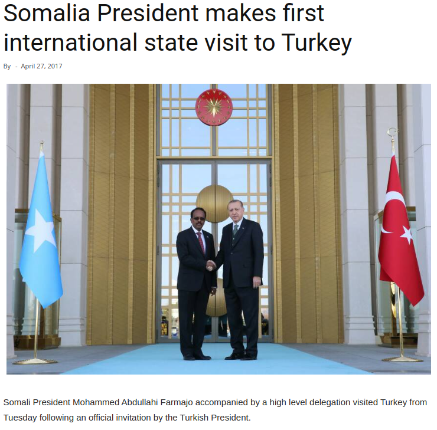
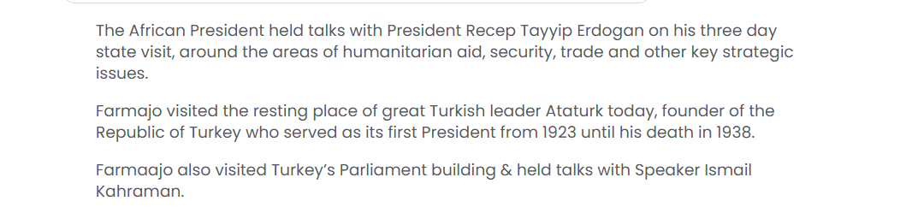

# **OSINT Exercise #003**

---

## **Description**

In April 2017, Mohamed Abdullahi Farmaajo, the then president of Somalia, visited Turkey. A news agency published a photo where he was seen shaking hands with Recep Tayyip Erdoğan, the country’s president. The article did not disclose where the photo was taken. Your task is to find out the name and coordinates of the location seen below.

Click [here](Resources/osint-exercise-003-picture.jpg) to see the photo on its own.

---

## **Solution**

### **Key Points:**

- Image from 17 April 2017
- President of Somalia - `Mohamed Abdullahi Farmaajo` visited Turkey.
- President of Turkey - `Recep Tayyip Erdoğan`.

### **Step 1: Reverse Image Lookup**

Using a reverse image search, we found a matching image on a news website:

A [website](https://africa.cgtn.com/somalia-president-makes-first-international-state-visit-to-turkey/) with the exact image about this visit mentions that `Farmaajo also visited Turkey’s Parliament building`. This building is also known as `The Grand National Assembly`.

### **Step 2: Verifying the Location**

Further research revealed another statement: `President Erdogan warmly welcomed his Somali counterpart to the presidential palace`.

We searched for `Turkey presidential palace handshake area` and found a [website](https://www.theguardian.com/world/gallery/2014/oct/29/turkeys-new-presidential-palace-unveiled-in-pictures) with images of the Presidential Palace.

After additional analysis, we found the coordinates: `39.9308873, 32.7990765`.

By cross-referencing other images taken at the same location, we confirm the exact coordinates as:

`39°55'52.06"N, 32°47'59.00"E`

---

## **Final Answers**

**Coordinates:** `39.93113°, 32.79972°`

---

**Co-author:** @atsggx