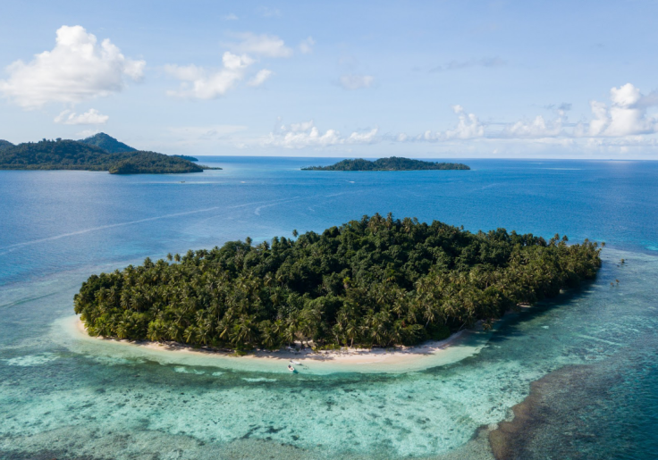
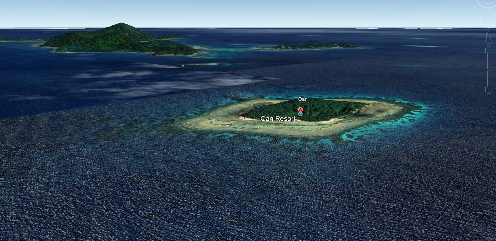

# **OSINT Exercise #004**

---

## **Description**

This is a photo of a resort located on an island.

a) What is the name of the resort?
b) What are the coordinates of the island?
c) In which cardinal direction was the camera facing when the photo was taken?

Click [here](Resources/osint-exercise-004-big-picture.jpg) to open the photo in a new tab.

---

## **Solution**

### **Key Points**
- An island is in the image
- The photo features a resort

### **Step 1: Identifying the Resort**
Using Reverse Image Lookup with Google, we identified the resort as `OAN Resort`.

### **Step 2: Finding the Coordinates**
Using Google Earth Pro, we obtained the coordinates of `OAN Island`:  
`7°21'48.41"N, 151°45'20.52"E` ~ `7.363447, 151.755700`.

### **Step 3: Determining the Camera Direction**
To determine the perspective, we matched the angle of the image with the known layout of the island.

Through a process of hit and trial, we confirmed that the perspective aligns with the direction `NorthWest`.

---

## **Final Answers**

a) `OAN Resort`
b) `7.363447, 151.755700`
c) `NorthWest`

---

**Co-author:** @atsggx