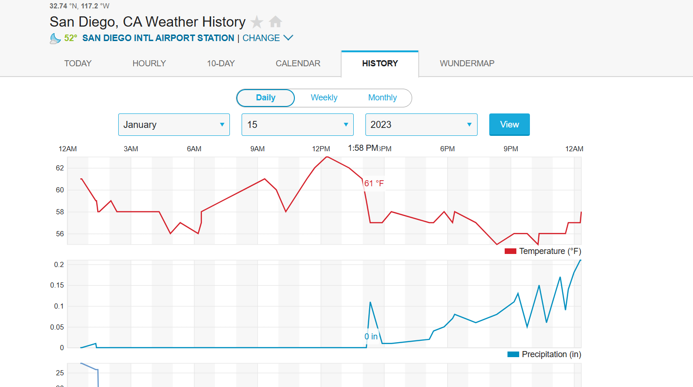

# **OSINT Exercise #005**

---

## **Description**

The image below is a screenshot from a zoo live cam. It was taken on January 15, 2023, at around 2 PM local time. Please answer the following questions:

### **Questions:**

a) In which zoo are these polar bears located?
b) What was the temperature at the time of the screenshot?
c) What were the exact coordinates of where the bears were lying down?

Click [here](Resources/osintexercises005.webp) to open the photo in a new tab.

---

## **Solution**

### **Key Points**
- Zoo Live Cam
- Taken on January 15, 2023, at around 2 PM local time

### **Step 1: Identifying the Zoo**

The live stream from the [Polar Cam](https://zoo.sandiegozoo.org/cams/polar-cam) matches the environment in the image. This confirms that the polar bears are located at **San Diego Zoo**.

**Answer:** San Diego Zoo

---

### **Step 2: Determining the Temperature**

Using historical weather data from San Diego on January 15, 2023, at 2 PM, the recorded temperature was **61°F**.

**Answer:** 61°F

---

### **Step 3: Identifying the Coordinates**

By analyzing the location of the **Polar Bear Plunge** exhibit at San Diego Zoo on Google Earth Pro, the estimated coordinates where the polar bears were lying down are **32.73459, -117.15461**.

**Answer:** 32.73459, -117.15461

---

## **Final Answers**

a) **San Diego Zoo**
b) **61°F**
c) **32.73459, -117.15461**

---

**Co-author:** @atsggx

