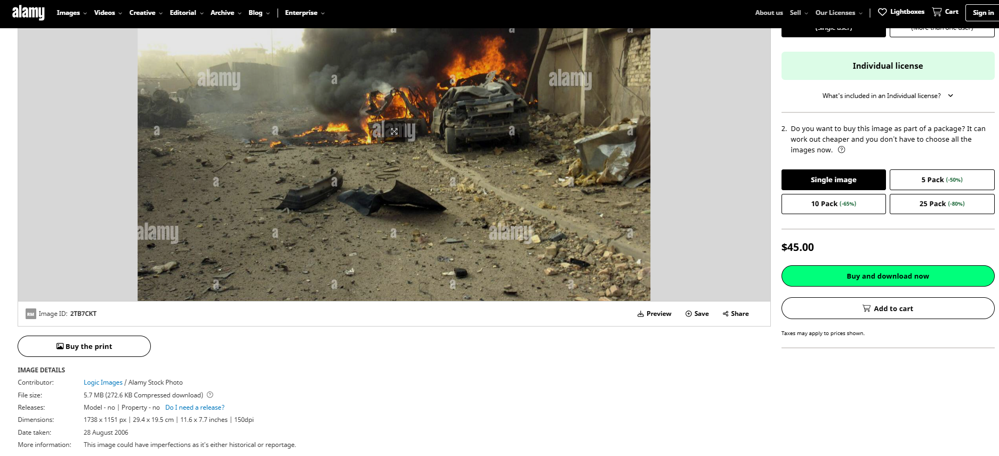

# **OSINT Exercise #006**  

---  

## **Description**  

On January 19, 2023, a journalist with almost 140k followers on Twitter shared an image of a destroyed vehicle amidst a large cloud of smoke and fire. The tweet said:  

> “BREAKING: TTP carried out a suicide attack on a police post in Khyber city of Pakistan that killed three Pakistani police officers.“  

The photo is not of the event described by the journalist.  

### **Task:**  
a) Verify the statement above.  

Click [here](Resources/osintexercise006.webp) to open the photo in a new tab.  

  

---  

## **Solution**  

### **Key Points**  
- Date: **January 19, 2023**  
- Journalist with **~140k followers** on Twitter  
- **Claim:** Suicide attack on a police post in Khyber city of Pakistan  
- **Reported Casualties:** Three Pakistani police officers  

### **Step 1: Reverse Image Search**  
Using **Tineye**, the image was found on the **Alamy website** with the following details:  

🔗 [Alamy Source](https://www.alamy.com/waziriyaautobombeirak-image574866988.html?irclickid=1aSXKbXXHxyKRnpzHS0iCSLIUks2obUFd3UE0k0&utm_source=77643&utm_campaign=Royalty-free%20stock%20photos%20and%20images%20%E2%80%93%20Alamy%20&utm_medium=impact&irgwc=1)  

  

📌 **Finding:** The image was originally published in **2006**, proving that the **Twitter post is fake**.  

---  

## **Final Answer**  

✅ **The claim in the tweet is false**. The image was taken from **2006** and does not depict the January 19, 2023, attack.  

🔗 **Source:** [Alamy website](https://www.alamy.com/waziriyaautobombeirak-image574866988.html?irclickid=1aSXKbXXHxyKRnpzHS0iCSLIUks2obUFd3UE0k0&utm_source=77643&utm_campaign=Royalty-free%20stock%20photos%20and%20images%20%E2%80%93%20Alamy%20&utm_medium=impact&irgwc=1)  

---  

**Co-author:** @atsggx  