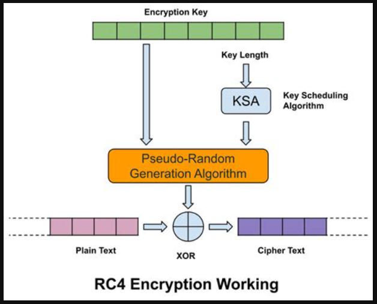

## **Challenge Name: Crack 200 - Gently Down the Stream**

### **Description**

You might have noticed by now that I've been throwing in a lot of tricks for the crack challenges. Not this time. This time we're getting back to basics. Kindergarten stuff. If you've never done a challenge like this before, don't be intimidated. This is all about learning the ABCs of password cracking. It's just four simple steps, repeated twice. What you learn here might not apply to all password cracks, but it will at least get you through this one.

A. **Always read up on your cipher.** Research is the most important step. Do this twice because it's proven that repeated exposure improves learning.  
B. **Be prepared.** Download a good wordlist. It doesn't hurt to do that twice, too, since the first one might get worn out if it takes a long time to crack.  
C. **Calibrate your password cracking rig.** I use an RKO King Kong for mine. Then calibrate your other cracking rig. My backup is a Kempe Gowda 3.  
D. **Dead chicken.** In the 90's, there was an idiom in the computer world: "Wave a dead chicken." The idea being that you do everything to prepare and at a certain point all you can do is pray the thing works. Well, you might as well wave two dead chickens, because all you can do now is wait for it to finish.

Below is a diagram to help you understand the cipher.

I'll also tell you that the password uses only A-Z. You'll also need the ciphertext, obviously:  
`71 81 13 f7 f7 b2 87 bd c6 77 68 67 25 ae fd 99 00 6e 2e 53 e6 60 50 50 ae a8 0f 9b 0a`

---

### **Approach**

The encryption method used is **RC4**.  

1. **Ciphertext and Plaintext**  
   - The ciphertext is provided as:  
     `71 81 13 f7 f7 b2 87 bd c6 77 68 67 25 ae fd 99 00 6e 2e 53 e6 60 50 50 ae a8 0f 9b 0a`

2. **RC4 Overview**  
   - **Key Scheduling Algorithm (KSA)**:  
     - Initializes the state array \( S \), where each element \( S[i] = i \).
     - A key array \( K \) is also initialized and used to modify \( S \).
     - The values in \( S \) are swapped in the KSA process.

   - **Pseudo-Random Generation Algorithm (PRGA)**:  
     - Generates the keystream by iterating through the state array and swapping values.
     - The keystream is then XORed with the plaintext to produce the ciphertext.

3. **Known Plaintext Attack**  
   - The known plaintext is `poctf{uwsp` (12 characters).  
   - Using XOR between the ciphertext and the known plaintext, we can derive part of the key.  

4. **Key Analysis**  
   - The derived key from XORing the known plaintext and ciphertext is `AABBCCDD`.

5. **Decryption**  
   - Using the key `AABBCCDD` and the provided ciphertext, I was able to successfully decrypt the password.

6. **Decrypting with Python**  
   - Ran the provided [decrypt.py](Resources/decrypt.py) script using a good wordlist ([wordlist.txt](Resources/wordlist.txt)) to crack the password.

---

### **Flag**

`poctf{uwsp_l16h7_1n_7h3_d4rk}`

---
