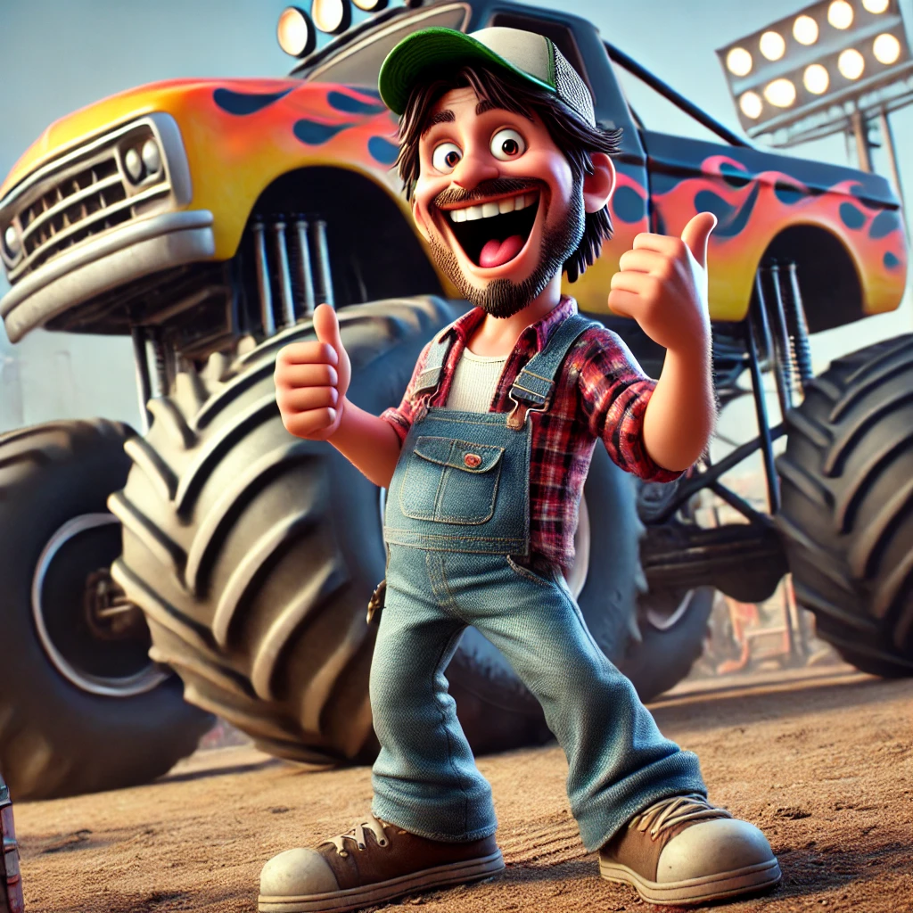
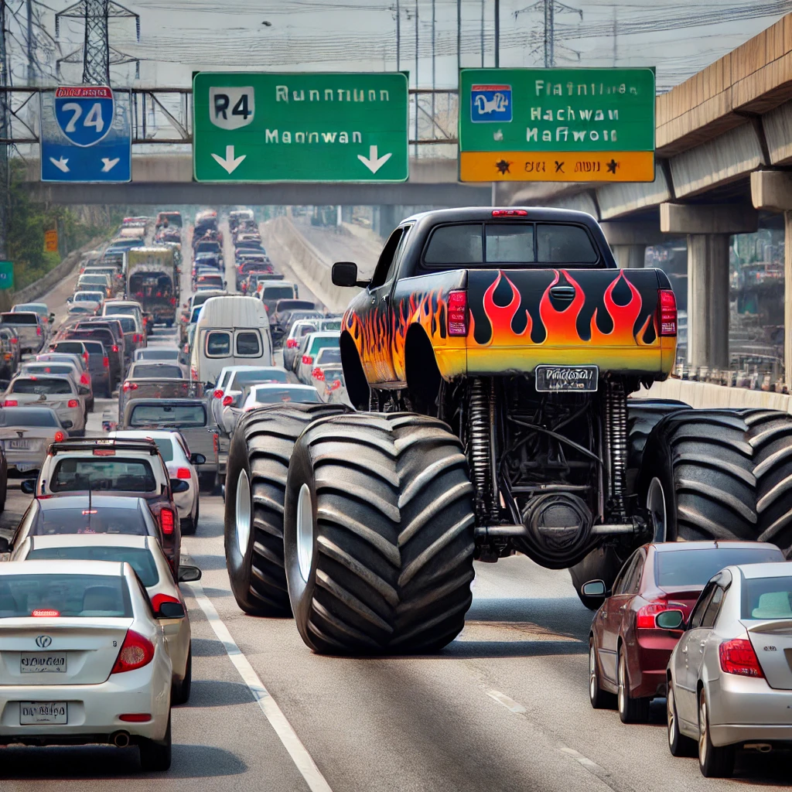

## **Challenge Name: Crack 300 - Guffaw of the Jackdaw**

### **Description**

Boy, these Crack challenges... You know, I seriously considered not including them this year. They're so dull. Like watching paint dry. I spent a lot of time trying to think of ways to make them interesting.  

You know the worst part? They don't really teach very practical skills. Social engineering is more reliable, and a little recon is usually better for building tailored dictionaries. Just look at the most common password lists - sports, cartoons that were popular when they were kids, food, sex, family members, pets, birthdays, all regularly appear as popular choices. Things we know, things we like.  

In fact, let's put it to the test...  

---

**Meet Jack:**  

- He **loves monster trucks**. Like, REALLY loves them.  

- Jack’s monster truck is his daily driver.  

- Every chance he gets, Jack attends monster truck jams and exhibitions.  

Jack is a man that likes **BIG things only**. Sliders? No, Jack likes the burger that weighs a full kilo. Petite fours? Jack says he's a grand fours man. Little Italy? Get out of here with that. Jack will have a worldwide Italian empire or nothing at all!  

---

Jack recently asked for advice on password management. He’s required to change his password every year for work. However, he tends to just **add numbers to the end of his password and increment them each year**.  

---

### **Approach**

1. **Identifying the Tool**  
   - The icon provided is for **OpenStego**, which is used for steganography (hiding text inside images).  

2. **Analyzing Jack's Preferences**  
   - Password hint: Jack likes **BIG things**, so the password is likely **all uppercase**.  
   - Jack’s love for monster trucks hints that the password might relate to this theme.  
   - He increments the password every year by appending a number.  

3. **Gathering Monster Truck Names**  
   - Used the [Monster Jam Truck Website](https://www.monsterjam.com/en-us/trucks) to collect names of trucks Jack might reference.  
   - Created a wordlist using **cewl** to scrape words from the website.  

4. **Constructing the Wordlist**  
   - All words were converted to **uppercase** to match Jack’s preference for "BIG things."  
   - Appended numbers ranging from `1` to `25` to simulate yearly increments.

5. **Cracking the Password**  
   - Ran the custom wordlist against the OpenStego file.  
   - Successfully cracked the password: **MONSTERJAM24**.  

6. **Extracting the Flag**  
   - Used OpenStego to extract the hidden text and retrieved the flag.

---

### **Flag**

`poctf{uwsp_p4r7_0f_7h3_m4ch1n3}`

--- 
