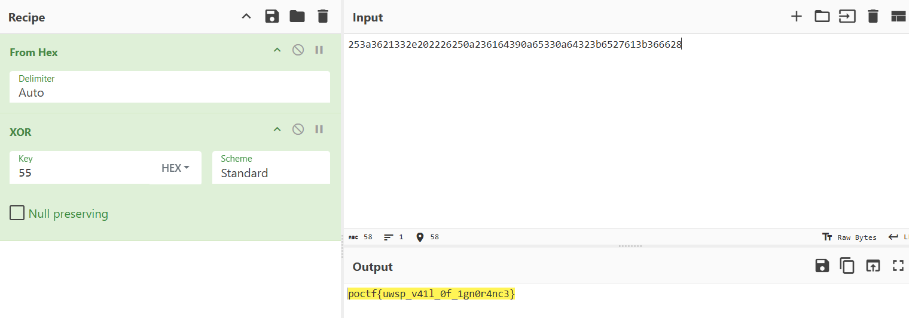

## **Challenge Name: Crypto 300 - Overall a Flop**

### **Description**

In this challenge, you are provided with an ECC public key and an encrypted message. The encryption was performed using a weak ECC private key, and your goal is to recover the private key and decrypt the message. The elliptic curve parameters used are also provided:  
- **Curve Name**: secp256r1  
- **Key Size**: 256  

**Provided Data**:  
**Public Key**:  
```
-----BEGIN PUBLIC KEY-----
MFkwEwYHKoZIzj0CAQYIKoZIzj0DAQcDQgAEgDCfhbX0SZnIrsFjH+7pCD65Fi7E
etLPQEmkdmDYMJ2hvXIdGvqNtf4b78vCI6tElddaCw+21+IRiOevSS4G3g==
-----END PUBLIC KEY-----
```

**Ciphertext (c)**:  
```
8a258a3a8a368a218a338a2e8a208a228a268a258a0a8a238a618a648a398a0a8a658a338a0a8a648a328a3b8a658a278a618a3b8a368a668a28
```

---

### **Approach**

Initially, the problem appeared to involve elliptic curve cryptography (ECC) key recovery. After reading through numerous resources on ECC, I realized the challenge might involve a simpler flaw in the ciphertext itself rather than requiring advanced cryptographic techniques.

#### Observations:
1. The ciphertext contains a repetitive pattern of `8a`, suggesting the encryption might involve XOR or some simple masking.
2. Analyzing the structure, I decided to remove the repetitive `8a` blocks and focus on the remaining data.
3. Knowing the flag format starts with `poctf{uwsp_`, I XORed the remaining bytes of the ciphertext with this known plaintext to infer the encryption key.

#### Key Recovery:
From the XOR operation, the key was found to be `55`.

#### Decryption:
Using the key `55`, I XORed the ciphertext to decrypt the full message, revealing the flag.



---

### **Flag**

`poctf{uwsp_v41l_0f_1gn0r4nc3}`

---
