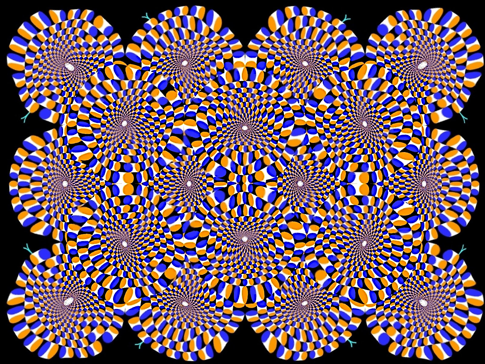

### **Challenge Name: DF 100 - A Flat Circle**

---

### **Description**

Time is a flat circle. Our lives begin on the edge of that disc and revolve around it endlessly. Each revolution brings us back to where we started, but with the wisdom of our journey. History doesn't repeat itself, but it rhymes. 

Every revolution is a spiral—a shape omnipresent in nature. Think of water flowing around a drain, spiraling into the void. Similarly, life circles the proverbial drain, a journey around and around, inching closer to the dark void of the unknown.

Errors made cannot be undone. The best we can do is examine and learn from them, leaving guidance for others to better navigate their journey. Yet, maintaining perspective can be challenging. The truth often stares us in the face, obscured by distractions like fear, hubris, and righteousness. 

Here's a riddle wrapped in a challenge, inspired by the cyclical nature of life. Start with this intriguing optical illusion:



---

### **Approach**

The challenge provides a **PNG file**. Here's how we uncover its secrets:

1. **Initial Analysis:**
   - Ran the `file` command to confirm the file's authenticity. It appears to be a valid PNG image.
   
2. **Steganographic Tools:**
   - Used `zsteg -a` to analyze the file for hidden data. Found a string of interest:
     ```
     26245786966000049492a00080000000b000001040001000000400600000101040001000000b00400000201030003000000920000001201030001000000010000001a01050001000000980000001b01050001000000a0000000280103000100000002000000310102000d000000a80000003201020014000000b60000001202030002000000010001006987040001000000ca000000000000000800080008004800000001000000480000000100000047494d5020322e31302e33360000323032343a31303a33312031373a31343a313600040000900700040000003032323001a00300010000000100000002a00400010000004006000003a0040001000000b004000000000000
     ```
   - Decoded the hex string, which revealed metadata suggesting the image was created using GIMP, along with a modification timestamp.

3. **Exif Data:**
   - Inspected the EXIF metadata using `exiftool`. Found no additional clues besides confirming the use of GIMP.

4. **Stegsolve Analysis:**
   - Used `stegsolve` to transform the image and examine different bit planes.
   - In the **gray bits plane**, the flag became visible, embedded as text within the image.

---

### **Flag**

`poctf{uwsp_7h3_m4n_1n_7h3_h16h_c457l3}`

--- 
