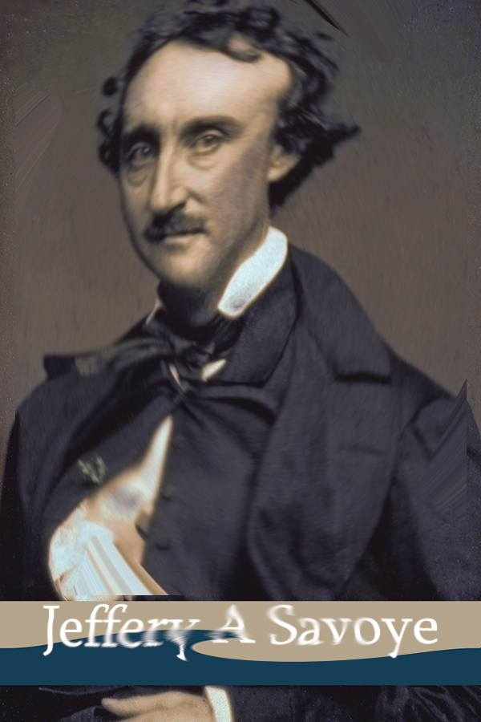

## **Challenge Name: OSINT 100 - Novel Means of Lying**

---

### **Description**

It's nearly Halloween (for those countries that celebrate it.) Naturally, I'm also a bit of a fan of the horror genre so this is a great time of year for me. In this challenge, I'd like for you to track down a series of people that seem to have a similar fascination. It will require multiple steps.

First, reverse the distortion on this image. Find out who these people are, and what they have in common.

[Swirled image](Resources/OSINT100-2.png)

This month (October 2024) was a very special anniversary. They even held a modest event to commemorate it with a keynote presentation.

It looks incredibly interesting! The password for the archive that contains the flag is the work phone number of the speaker exactly as you find it (special characters and all).

#### **File Provided**  
- [OSINT100-2.zip](Resources/OSINT100-2.zip)

---

### **Approach**

1. **Reversing the Image Distortion**  
   - The provided image had a swirl distortion. To reverse it, I used GIMP and adjusted the **Whirl** and **Radius** settings iteratively:
     - **For the central image area:** Whirl = -563.2, Radius = 0.977
     - **For the bottom area with text:** Whirl = -200.2, Radius = 0.98  
   - This resulted in a clear image of Edgar Allan Poe and associated text.
   

2. **Identifying the People in the Image**  
   - Using Google Reverse Image Search, I identified the person as **Edgar Allan Poe**.  
   - The accompanying name, **Jeffrey A. Savoye**, was found to be associated with the Edgar Allan Poe Society of Baltimore.  

3. **Finding the Event**  
   - Research on the Edgar Allan Poe Society of Baltimore revealed they conduct commemorative events.  
   - In October 2024, they held a special anniversary event on October 6, with keynote speaker **Ashley Kniss**.

4. **Finding the Keynote Speaker’s Work Phone**  
   - Searching for Ashley Kniss’s professional contact information led to her work phone number: `443-352-4039`.

5. **Unlocking the Archive**  
   - I used the phone number `443-352-4039` as the password for the provided ZIP archive.  
   - Once unlocked, the flag was retrieved.

---

### **Flag**

`poctf{uwsp_7h3_r4v3n_n3v3rm0r3}`

---