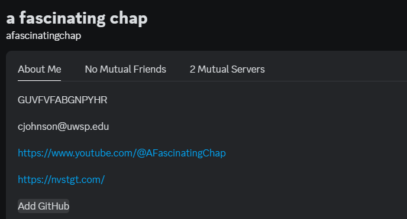
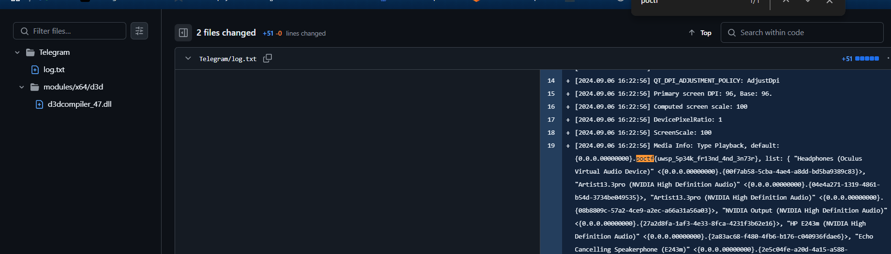

### **Challenge Name: OSINT 100 - Seen and Then Forgotten**

---

### **Description**

I really had to commit to pull this one off. That's right - your subject on this one is me, Prof. Johnson. However, I'd really rather not have all of you phish my dentist for my patient records and such, so I'll tell you that your trail starts on Discord and you will find the flag out on the public Internet - no stalking, social engineering, or blackmail required! That's good news for both of us! Mostly me!

---

### **Approach**

1. **Investigating the Discord Profile**  
   - The first clue provided was to start on Discord. Upon checking the Discord profile of Prof. Johnson, a GitHub link was referenced.  

   **Reference Screenshot:**  
     

2. **Exploring the GitHub Profile**  
   - Navigating to the linked GitHub profile, I explored the commit history of their repositories.  
   - Using the flag format `poctf{...}`, I searched through the commits for relevant text.  

3. **Locating the Flag**  
   - Within the commit history, I found a commit that included the flag text.  

   **Reference Screenshot:**  
     

4. **Flag Identification**  
   - The flag text followed the required format: `poctf{uwsp_5p34k_fr13nd_4nd_3n73r}`  

---

### **Flag**

`poctf{uwsp_5p34k_fr13nd_4nd_3n73r}`

---
